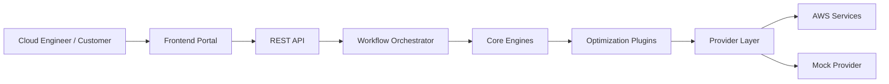
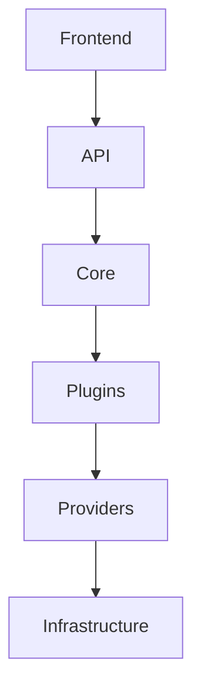
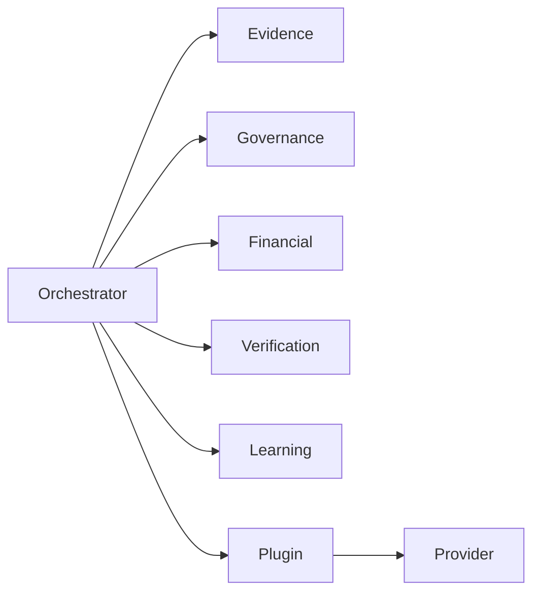
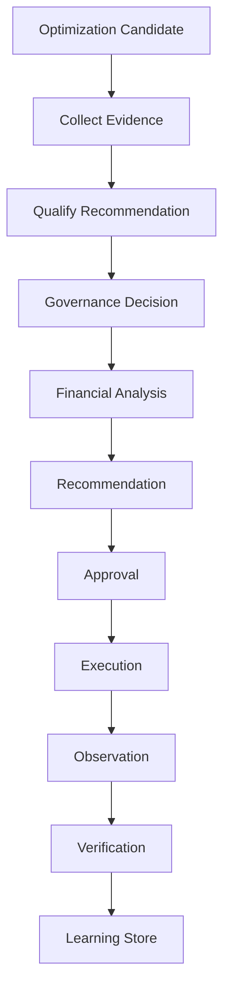
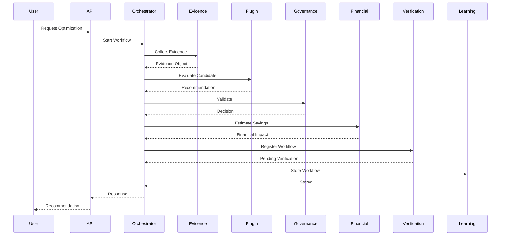
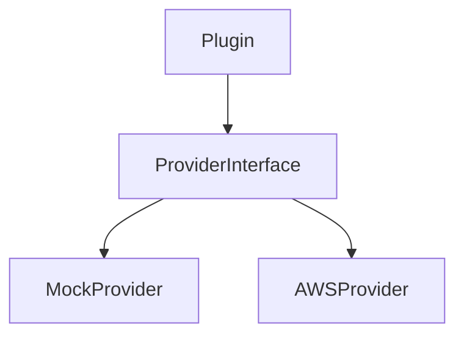
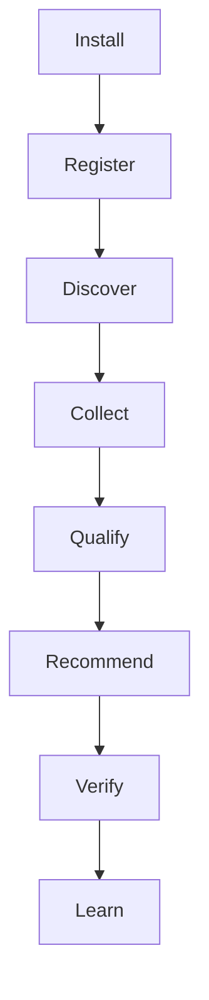
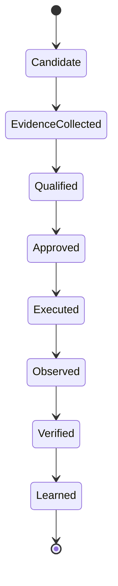
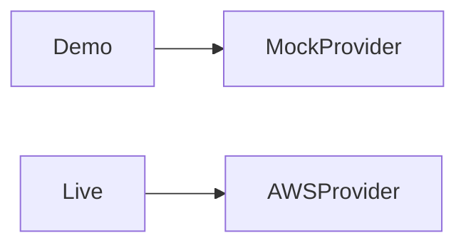

# Architecture Specification (Version 2.0)

**Project:** EWS AI Cloud Optimization Platform (SISU'M)

**Version:** 2.0

**Status:** Draft (Sprint 0)

**Owner:** Engineering Team

**Primary Reviewer:** Mpho (Tech Lead)

**Contributors:** Obianuju, Florence

**Last Updated:** July 2026

## Table of Contents

- [Purpose](#1-purpose)
- [Architectural Vision](#2-architectural-vision)
- [Guiding Principles](#3-guiding-principles)
- [High-Level System Architecture](#4-high-level-system-architecture)
- [Architectural Layers](#5-architectural-layers)
- [System Components](#6-system-components)
- [Repository Structure](#7-repository-structure)
- [Dependency Rules](#8-dependency-rules)
- [Design Principles](#9-design-principles)
- [Architecture Governance](#10-architecture-governance)

## 1. Purpose

This document defines the official software architecture for the EWS AI Cloud Optimization Platform (SISU'M).

It serves as the single source of truth for:

- System architecture
- Backend organization
- Frontend organization
- Folder structure
- Component responsibilities
- Dependency rules
- Engineering boundaries
- Future extensibility

Every engineer and AI coding assistant must follow this specification.

If implementation differs from this document, this document takes precedence until formally updated.

## 2. Architectural Vision

SISU'M is not an EC2 optimization tool.

SISU'M is a Cloud Optimization Decision Platform.

Its purpose is to help organizations make trustworthy optimization decisions through:

- Evidence
- Governance
- Financial analysis
- Verification
- Continuous learning

Optimization recommendations are only one capability of the platform.

The platform itself is permanent.

Optimization domains are replaceable plugins.

## 3. Guiding Principles

### 3.1 Modular Architecture

Every major responsibility belongs to one module.

Examples:

- Evidence belongs to the Evidence Engine.
- Governance belongs to the Governance Engine.
- Financial calculations belong to the Financial Engine.
- Optimization logic belongs to Plugins.

No module should perform another module's responsibility.

### 3.2 Plugin-Based Platform

The platform must support multiple optimization domains without changing the core architecture.

Example plugins:

- EC2
- EBS
- RDS
- S3
- Lambda
- Kubernetes
- Savings Plans
- Reserved Instances
- Azure
- Google Cloud

Adding a plugin must not require redesigning the platform.

### 3.3 Provider Abstraction

Business logic must never directly communicate with AWS.

Instead:

```
Platform
   ↓
Provider Interface
   ↓
Mock Provider
   or
AWS Provider
```

This allows:

- Demo Mode
- Offline development
- Unit testing
- Future cloud providers

without changing application logic.

### 3.4 Separation of Concerns

Each layer has exactly one responsibility.

- **Presentation** handles user interaction.
- **API** handles requests.
- **Orchestrator** coordinates workflows.
- **Engines** implement business rules.
- **Plugins** implement optimization logic.
- **Providers** retrieve data.
- **Infrastructure** manages external services.

### 3.5 Explainability

Every recommendation must explain:

- Why it exists
- What evidence supports it
- What risk exists
- What governance applies
- Expected financial impact
- Confidence level
- Verification status

No recommendation should be a black box.

### 3.6 Closed-Loop Optimization

Every recommendation must pass through the complete lifecycle.

```
Evidence
   ↓
Qualification
   ↓
Governance
   ↓
Financial Analysis
   ↓
Recommendation
   ↓
Approval
   ↓
Execution
   ↓
Observation
   ↓
Verification
   ↓
Learning
```

Savings alone do not complete the workflow.

## 4. High-Level System Architecture

```
                    +-------------------------+
                    |      Web Frontend       |
                    +-----------+-------------+
                                |
                                |
                        REST / HTTPS
                                |
                                ▼
                  +---------------------------+
                  |         API Layer         |
                  +------------+--------------+
                               |
                               ▼
                 +----------------------------+
                 |   Workflow Orchestrator    |
                 +------------+---------------+
                              |
      ---------------------------------------------------
      |            |            |             |          |
      ▼            ▼            ▼             ▼          ▼

 Evidence     Governance    Financial    Verification  Learning
  Engine         Engine       Engine         Engine      Store

                    |
                    ▼

             Optimization Plugin

                    |
                    ▼

              Provider Interface

             ┌──────────┴───────────┐
             ▼                      ▼

      Mock Provider          AWS Provider

                    |
                    ▼

              Infrastructure

         CloudWatch | Pricing API

       Compute Optimizer | S3

          DynamoDB | EventBridge
```

## 5. Architectural Layers

The system consists of seven architectural layers.

### Layer 1 — Presentation Layer

**Purpose:** Provide user interaction.

**Responsibilities:**

- Dashboard
- Reports
- Recommendations
- Verification
- Settings
- History

**Never:**

- calculate savings
- call AWS directly
- implement business rules

### Layer 2 — API Layer

**Purpose:** Expose REST endpoints.

**Responsibilities:**

- Request validation
- Response formatting
- Error handling
- Authentication (future)
- Authorization (future)

**Never:**

- implement optimization logic
- calculate readiness
- calculate confidence

### Layer 3 — Workflow Layer

**Purpose:** Coordinate business processes.

**Responsibilities:**

- call engines
- manage execution order
- handle retries
- handle failures
- maintain workflow state

**Never:**

- implement optimization logic

### Layer 4 — Core Business Layer

**Purpose:** Execute platform business logic.

**Contains:**

- Evidence Engine
- Governance Engine
- Financial Engine
- Verification Engine
- Learning Engine

This layer represents the heart of SISU'M.

### Layer 5 — Plugin Layer

**Purpose:** Implement optimization capabilities.

**Examples:**

- EC2
- RDS
- EBS
- S3
- Lambda
- Kubernetes

Plugins should never contain platform logic.

### Layer 6 — Provider Layer

**Purpose:** Supply data to the platform.

**Supported providers:**

- Mock Provider
- AWS Provider

**Future:**

- Azure Provider
- GCP Provider

The rest of the application must not know which provider is active.

### Layer 7 — Infrastructure Layer

**Purpose:** Integrate with external systems.

**Contains:**

- Logging
- Monitoring
- Persistence
- Configuration
- Secrets Management

Infrastructure never contains business logic.

## 6. System Components

The architecture is divided into permanent platform components and replaceable components.

### Permanent Components

These rarely change.

- API
- Orchestrator
- Core Engines
- Shared Models
- Providers
- Infrastructure

### Replaceable Components

These can evolve independently.

**Optimization Plugins**

Examples:

```
EC2 Plugin
   ↓
RDS Plugin
   ↓
EBS Plugin
   ↓
S3 Plugin
   ↓
Kubernetes Plugin
```

## 7. Repository Structure

```
backend/
│
├── api/
│   ├── controllers/
│   ├── routes/
│   ├── middlewares/
│   ├── validators/
│   └── responses/
│
├── core/
│   ├── engines/
│   │   ├── evidence/
│   │   ├── governance/
│   │   ├── financial/
│   │   ├── verification/
│   │   └── learning/
│   │
│   ├── providers/
│   │   ├── interfaces/
│   │   ├── mock/
│   │   └── aws/
│   │
│   ├── orchestrator/
│   │
│   ├── shared/
│   │   ├── types/
│   │   ├── constants/
│   │   ├── errors/
│   │   └── utils/
│   │
│   └── models/
│
├── plugins/
│   ├── ec2/
│   ├── rds/
│   ├── ebs/
│   ├── s3/
│   ├── lambda/
│   ├── kubernetes/
│   └── shared/
│
├── infrastructure/
│   ├── config/
│   ├── logging/
│   ├── persistence/
│   ├── monitoring/
│   └── security/
│
├── tests/
│   ├── unit/
│   ├── integration/
│   └── mocks/
│
└── index.ts

frontend/
│
├── components/
├── layouts/
├── pages/
├── services/
├── hooks/
├── store/
├── assets/
├── styles/
└── utils/

docs/
│
├── architecture/
├── api/
├── engineering/
├── backlog/
└── diagrams/
```

## 8. Dependency Rules

The platform follows strict dependency direction.

```
Presentation
   ↓
API
   ↓
Workflow Orchestrator
   ↓
Core Engines
   ↓
Plugins
   ↓
Providers
   ↓
Infrastructure
```

**Allowed dependencies:**

- Frontend → API
- API → Orchestrator
- Orchestrator → Core Engines
- Core Engines → Plugins
- Plugins → Providers
- Providers → Infrastructure

**Forbidden dependencies:**

- Frontend → AWS SDK
- Plugins → Frontend
- Financial Engine → CloudWatch
- Evidence Engine → Pricing Logic
- Infrastructure → Business Rules
- Providers → Business Decisions

Any pull request violating these rules must not be merged.

## 9. Design Principles

The following software design principles are mandatory:

- Single Responsibility Principle (SRP)
- Open/Closed Principle (OCP)
- Liskov Substitution Principle (LSP)
- Interface Segregation Principle (ISP)
- Dependency Inversion Principle (DIP)

**Additional architectural patterns:**

- Provider Pattern
- Strategy Pattern
- Factory Pattern
- Repository Pattern
- Adapter Pattern

**Future versions may introduce:**

- Event-Driven Architecture
- Observer Pattern
- CQRS (if justified)

No new design pattern should be introduced without documenting the decision.

## 10. Architecture Governance

Architecture is owned by the engineering team, with clear responsibilities.

| Area | Primary Owner | Responsibility |
|---|---|---|
| Overall Architecture | Mpho | Approves architectural decisions and major refactoring |
| Core Engines | Obianuju | Business logic implementation and engine consistency |
| Frontend Experience | Florence | UI architecture and frontend integration |
| Plugins | Shared | Build optimization plugins following the Plugin Specification |
| Infrastructure | Mpho | Deployment, monitoring, configuration, and security |
| Documentation | Shared | Keep documentation synchronized with implementation |

### Architecture Change Policy

Any architectural change must:

1. Be documented in an Architecture Decision Record (ADR).
2. Be reviewed by the Tech Lead.
3. Update this Architecture Specification if it affects structure or responsibilities.
4. Be communicated to all contributors before implementation.

No engineer or AI coding assistant may introduce a new architectural pattern or dependency direction without following this process.

## 11. Core Platform Overview

The Core Platform is the permanent foundation of SISU'M.

Unlike plugins, which can be added or removed over time, the Core Platform is responsible for orchestrating every optimization workflow regardless of the cloud service being optimized.

The Core Platform consists of:

- Workflow Orchestrator
- Evidence Engine
- Governance Engine
- Financial Engine
- Verification Engine
- Learning Engine
- Provider Layer

Optimization plugins interact with these engines but never replace them.

## 12. Workflow Orchestrator

### Purpose

The Workflow Orchestrator coordinates every optimization workflow from beginning to end.

It is responsible for ensuring that every engine executes in the correct sequence.

It contains no optimization logic.

Instead, it delegates work to the appropriate engine.

### Responsibilities

The Orchestrator must:

- Start optimization workflows
- Maintain workflow state
- Coordinate engine execution
- Handle failures
- Retry recoverable operations
- Record workflow status
- Trigger verification
- Trigger learning updates

### Workflow Sequence

```
Optimization Request
        │
        ▼
Evidence Engine
        │
        ▼
Optimization Plugin
        │
        ▼
Governance Engine
        │
        ▼
Financial Engine
        │
        ▼
Recommendation
        │
        ▼
Verification Engine
        │
        ▼
Learning Engine
```

### Workflow Rules

The Orchestrator:

- ✔ Coordinates
- ✔ Tracks workflow state
- ✔ Handles retries
- ✔ Handles failures
- ✔ Logs progress

The Orchestrator never:

- Calculates savings
- Reads CloudWatch
- Calls AWS SDK directly
- Implements optimization rules

## 13. Evidence Engine

### Purpose

The Evidence Engine collects and normalizes information required to evaluate an optimization candidate.

Evidence is the foundation of every recommendation.

No recommendation may exist without evidence.

### Responsibilities

The Evidence Engine collects:

- Resource inventory
- Utilization metrics
- Pricing references
- Resource metadata
- Tags
- Historical utilization
- Optimization recommendations
- Governance metadata

### Inputs

Data arrives from Providers only.

Examples:

- Mock Provider
- AWS Provider

### Outputs

The Evidence Engine produces a standardized Evidence Object.

Example:

```json
{
  "resourceId": "i-123456",
  "resourceType": "EC2",
  "cpuUtilization": 12,
  "memoryUtilization": 34,
  "monthlyCost": 85.20,
  "region": "us-east-1",
  "recommendation": "t3.medium"
}
```

### Rules

The Evidence Engine must never:

- Estimate savings
- Approve recommendations
- Execute changes

## 14. Governance Engine

### Purpose

The Governance Engine determines whether a recommendation is permitted.

Savings never override governance.

### Responsibilities

Evaluate:

- Business policies
- Environment
- Risk
- Maintenance windows
- Resource ownership
- Approval requirements

### Possible Decisions

- Approved
- Needs Approval
- Rejected

### Example Rules

Examples include:

- Production instances require approval.
- Development instances may auto-approve.
- Critical workloads require manual review.
- Blacklisted resources cannot be optimized.

### Outputs

```json
{
  "status": "Needs Approval",
  "reason": "Production workload",
  "approver": "Cloud Operations Team"
}
```

## 15. Financial Engine

### Purpose

Estimate financial impact.

### Responsibilities

Calculate:

- Current monthly cost
- Proposed monthly cost
- Monthly savings
- Annual savings
- Return on investment (ROI)
- Percentage savings

### Inputs

- Evidence
- Pricing
- Recommendation

### Outputs

```json
{
  "currentCost": 85.20,
  "recommendedCost": 58.60,
  "monthlySavings": 26.60,
  "annualSavings": 319.20,
  "roi": 31.2
}
```

### Rules

The Financial Engine never:

- Reads AWS APIs
- Makes recommendations
- Determines governance

## 16. Verification Engine

### Purpose

Determine whether execution produced the expected outcome.

### Responsibilities

Compare:

```
Before
   ↓
After
   ↓
Observed Savings
   ↓
Expected Savings
   ↓
Verification Status
```

### Possible Results

- Verified
- Partially Verified
- Failed Verification

### Example Output

```json
{
  "status": "Verified",
  "expectedSavings": 26.60,
  "actualSavings": 25.90,
  "variance": -0.70
}
```

## 17. Learning Engine

### Purpose

Capture historical optimization outcomes.

The Learning Engine improves future decisions.

It does not use Machine Learning in the MVP.

### Responsibilities

Store:

- Evidence
- Recommendations
- Governance decisions
- Verification
- Observed outcomes

Future AI capabilities will use this data.

## 18. Provider Layer

### Purpose

Separate business logic from infrastructure.

### Provider Interface

Every provider must implement:

```typescript
interface Provider {
  getResources()
  getMetrics()
  getPricing()
  getRecommendations()
}
```

### Supported Providers

**Mock Provider**

Purpose:

- Demo Mode
- Testing
- Development

**AWS Provider**

Purpose:

- Production
- Customer environments

### Future Providers

- Azure Provider
- Google Cloud Provider

### Provider Rules

Providers:

- ✔ Retrieve data
- ✔ Normalize responses
- ✔ Handle SDK interactions

Providers never:

- Calculate savings
- Approve recommendations
- Score confidence

## 19. Plugin Architecture

Plugins provide optimization intelligence.

They do not implement platform behavior.

### Current Plugin

- EC2

### Future Plugins

- RDS
- EBS
- S3
- Lambda
- Kubernetes
- Savings Plans
- Reserved Instances

### Plugin Structure

```
plugins/
    ec2/
        collector.ts
        qualifier.ts
        scorer.ts
        estimator.ts
        verifier.ts
        index.ts
```

### Plugin Responsibilities

Each plugin:

- Identifies optimization candidates
- Collects plugin-specific evidence
- Evaluates optimization rules
- Generates recommendations
- Supports verification

### Required Plugin Interface

Every plugin must expose:

- `collectCandidates()`
- `collectEvidence()`
- `qualify()`
- `scoreReadiness()`
- `scoreConfidence()`
- `estimateFinancialImpact()`
- `recommend()`
- `verify()`

## 20. Readiness vs Confidence

These are separate concepts.

### Readiness

Question:

> Can this recommendation be evaluated?

Measures:

- Telemetry completeness
- Pricing availability
- Governance completeness
- Recommendation persistence

### Confidence

Question:

> Should this recommendation be trusted?

Measures:

- Workload stability
- Historical consistency
- Recommendation quality
- Resource volatility

Readiness and Confidence must never be combined.

## 21. Internal Data Flow

Every optimization request follows this sequence.

```
Client
   ↓
REST API
   ↓
Workflow Orchestrator
   ↓
Evidence Engine
   ↓
Optimization Plugin
   ↓
Governance Engine
   ↓
Financial Engine
   ↓
Recommendation
   ↓
Verification Engine
   ↓
Learning Engine
   ↓
Response
```

## 22. Standard Recommendation Object

Every plugin must return the same structure.

```json
{
  "candidate": {},
  "evidence": {},
  "readiness": {},
  "confidence": {},
  "governance": {},
  "financialImpact": {},
  "recommendation": {},
  "verificationStatus": {}
}
```

Savings are one property.

They are not the product.

## 23. Error Handling

Every engine must return structured errors.

Example:

```json
{
  "success": false,
  "engine": "Evidence Engine",
  "reason": "Missing utilization metrics",
  "recovery": "Retry after metrics collection."
}
```

## 24. Logging Requirements

Every workflow step must log:

- Workflow ID
- Timestamp
- Engine
- Plugin
- Duration
- Status

Logs must never contain sensitive customer information.

## 25. Architecture Rules

The following rules are mandatory:

- ✔ Engines are permanent.
- ✔ Plugins are replaceable.
- ✔ Providers isolate infrastructure.
- ✔ Business logic never depends on AWS SDK.
- ✔ Every recommendation requires evidence.
- ✔ Every recommendation requires governance.
- ✔ Every recommendation requires financial analysis.
- ✔ Every recommendation must be verified.
- ✔ Every completed optimization becomes learning data.

Failure to follow these rules constitutes an architectural violation.

## 26. Infrastructure Architecture

### Purpose

The Infrastructure Layer provides all external services required to run SISU'M.

It is responsible for:

- Configuration
- Persistence
- Logging
- Monitoring
- Security
- Cloud integrations

Infrastructure supports the platform but never contains business logic.

## 27. Infrastructure Components

```
Infrastructure

├── Configuration
├── Logging
├── Monitoring
├── Persistence
├── Security
├── Scheduler
├── Notifications
└── Deployment
```

## 28. Configuration Management

### Purpose

Store application configuration separately from source code.

Examples include:

- Environment variables
- Feature flags
- AWS regions
- Timeouts
- Retry policies
- Logging levels

### Rules

- Never hardcode secrets.
- Configuration must be environment-specific.
- Local, Development, Staging, and Production environments must be isolated.

## 29. Persistence Layer

### Purpose

Persist platform data independently of business logic.

### MVP Storage

- DynamoDB
- Amazon S3

### Stored Data

- Workflow history
- Recommendations
- Verification results
- Learning history
- Audit logs
- Plugin metadata

Business logic must never know how data is physically stored.

## 30. Logging Architecture

Every workflow step must generate structured logs.

### Required Fields

- Timestamp
- Workflow ID
- Plugin
- Engine
- Operation
- Status
- Duration
- Severity

Example:

```json
{
  "workflowId": "wf-001",
  "engine": "Evidence Engine",
  "status": "Completed",
  "durationMs": 412
}
```

### Log Levels

- DEBUG
- INFO
- WARN
- ERROR

Production environments should default to INFO.

## 31. Monitoring

Monitoring is responsible for system health.

Metrics include:

- API latency
- Workflow duration
- Plugin execution time
- Failed workflows
- Verification failures
- Provider response time

Future metrics may include:

- Customer adoption
- Optimization success rate
- Monthly verified savings

## 32. Observability

The platform should answer:

- What happened?
- Why did it happen?
- Where did it happen?
- When did it happen?

Observability consists of:

- Logs
- Metrics
- Workflow history
- Audit records

## 33. Security Architecture

Security follows the principle of Least Privilege.

### Rules

- Read-only IAM permissions for MVP
- No embedded credentials
- Encrypt sensitive data
- Secure API endpoints
- Validate all inputs
- Sanitize all outputs

### Authentication

**MVP:**

No authentication required for Demo Mode.

**Production:**

Future support for:

- Amazon Cognito
- JWT
- OAuth2

Authentication must remain independent of business logic.

### Authorization

Future Role-Based Access Control (RBAC):

Roles may include:

- Administrator
- Cloud Engineer
- Finance
- Executive
- Read-Only Viewer

Authorization decisions belong to the API layer.

## 34. Secrets Management

Secrets include:

- API Keys
- Database credentials
- AWS credentials
- JWT signing keys

Rules:

- Never commit secrets to Git.
- Never hardcode credentials.
- Rotate secrets regularly.

## 35. Deployment Architecture

The MVP deployment is intentionally simple.

```
Developer
   ↓
GitHub
   ↓
GitHub Actions
   ↓
AWS
   ↓
Lambda
   ↓
API Gateway
   ↓
DynamoDB
   ↓
S3
```

Future deployment targets may include:

- ECS
- EKS
- Kubernetes

These are not part of the MVP.

## 36. CI/CD Pipeline

Every change follows:

```
Developer
   ↓
Feature Branch
   ↓
Pull Request
   ↓
Code Review
   ↓
Tests
   ↓
Merge
   ↓
Deployment
```

Every deployment must be repeatable.

## 37. Scalability Strategy

The platform is designed to evolve in phases.

### Phase 1

- Mock Provider
- Single engineer
- Demo Mode

### Phase 2

- AWS Provider
- First customer
- Production deployment

### Phase 3

- Multi-account AWS
- Multiple customers
- Multi-tenant architecture

### Phase 4

- Azure
- Google Cloud
- Enterprise features

### Phase 5

Decision Intelligence Platform

Supporting:

- Cloud Optimization
- Governance
- Carbon Optimization
- Security Optimization
- Compliance

## 38. Resilience

Failures should be expected.

The platform must:

- Retry transient failures
- Continue independent workflows
- Log failures
- Surface actionable error messages

The system should fail gracefully.

## 39. Disaster Recovery

The MVP recovery strategy includes:

- DynamoDB backups
- S3 versioning
- Infrastructure as Code (future)

Future improvements:

- Cross-region replication
- Automated failover

## 40. Performance Targets

Target metrics:

| Metric | Target |
|---|---|
| API Response | <500 ms |
| Workflow Start | <1 second |
| Evidence Collection | <5 seconds |
| Recommendation Generation | <10 seconds |
| Verification Lookup | <2 seconds |

Targets should be reviewed as the platform grows.

## 41. Cost Optimization Strategy

The MVP prioritizes low operating costs.

Use managed AWS services whenever possible.

Preferred services:

- Lambda
- DynamoDB
- S3
- EventBridge
- Step Functions
- CloudWatch

Avoid introducing services that increase complexity or recurring costs without a clear business need.

## 42. AI Adoption Strategy

Artificial Intelligence is introduced gradually.

### Phase 1

Deterministic rules.

No LLM.

### Phase 2

Statistical models.

Confidence calibration.

Threshold tuning.

### Phase 3

LLM assistance.

Use cases:

- Executive summaries
- Weekly reports
- Risk explanations
- Recommendation narratives

LLMs never participate in execution decisions.

### Phase 4

AI Agents

Possible responsibilities:

- Workflow coordination
- Multi-plugin optimization
- Intelligent scheduling

Agents remain outside the critical execution path.

## 43. Operational Modes

The platform supports two modes.

### Demo Mode

**Provider:**

Mock Provider

**Purpose:**

- Development
- Demonstrations
- Testing

### Live Mode

**Provider:**

AWS Provider

**Purpose:**

- Customer environments
- Production

Switching modes must require configuration only.

## 44. Operational Principles

Every deployment should satisfy:

- ✔ Reliable
- ✔ Observable
- ✔ Secure
- ✔ Explainable
- ✔ Repeatable
- ✔ Cost-efficient

## 45. Technical Debt Policy

Technical debt must be tracked explicitly.

Every known shortcut should include:

- Description
- Reason
- Risk
- Planned resolution

Technical debt is acceptable only when documented.

## 46. Architecture Decision Records (ADR)

Every significant architectural decision requires an ADR.

Each ADR must contain:

- Context
- Problem
- Alternatives
- Decision
- Consequences
- Date
- Owner

Store ADRs under:

```
docs/
└── architecture/
    └── adrs/
```

## 47. Architecture Review Checklist

Before any feature is merged, confirm:

- Correct folder placement
- No duplicated logic
- Dependency rules followed
- Provider abstraction maintained
- Engine responsibilities respected
- Plugin interface implemented
- Logging added
- Tests updated
- Documentation updated

Features failing any checklist item must not be merged.

## 48. Definition of Architectural Success

The architecture is considered successful if:

- New plugins require no core redesign.
- New providers require no business logic changes.
- Infrastructure changes do not affect platform logic.
- Demo Mode and Live Mode behave identically from the application's perspective.
- Every recommendation follows the complete evidence-to-learning lifecycle.
- The platform scales from a single engineer to a multi-cloud SaaS product without architectural rewrites.

Architecture is a long-term asset.

Every engineering decision should strengthen it rather than work around it.

## 49. System Context Diagram

The platform interacts with users, AWS services, and future cloud providers.



## 50. Container Diagram



## 51. Component Diagram



## 52. Optimization Workflow

Every optimization follows the same lifecycle.



## 53. Sequence Diagram



## 54. Provider Architecture



The application never communicates directly with AWS SDKs.

All infrastructure interactions pass through the Provider Interface.

## 55. Plugin Lifecycle

Every plugin follows the same lifecycle.



## 56. Recommendation State Diagram



## 57. Demo Mode vs Live Mode



Switching modes requires configuration only.

No business logic should change.

## 58. Plugin Expansion Roadmap

The platform is designed to grow through plugins.

### Phase 1

- EC2

### Phase 2

- RDS
- EBS
- S3
- Lambda

### Phase 3

- Savings Plans
- Reserved Instances
- Load Balancers
- GPU

### Phase 4

- Kubernetes
- Azure
- Google Cloud

The Core Platform remains unchanged.

## 59. Repository Growth Strategy

**Permanent folders:**

- `api/`
- `core/`
- `infrastructure/`
- `docs/`

**Growing folders:**

- `plugins/`
- `tests/`
- `adrs/`

The architecture should grow by adding plugins, not modifying the platform.

## 60. Architecture Constraints

The following constraints are mandatory.

### Platform

Must remain independent of:

- AWS
- Azure
- GCP

### Plugins

Must never:

- contain platform logic
- communicate directly with AWS SDK
- modify other plugins

### Providers

Must never:

- implement business logic
- estimate savings
- perform governance

### Infrastructure

Must never:

- determine optimization decisions
- contain recommendation logic

## 61. Future Evolution

The architecture supports future capabilities without redesign.

Future additions include:

- Multi-cloud providers
- AI-assisted reporting
- Machine learning calibration
- Carbon optimization
- Security optimization
- Compliance scoring
- Policy automation
- Enterprise governance

These capabilities should be introduced as new modules or plugins rather than altering existing architecture.

## 62. Glossary

| Term | Definition |
|---|---|
| Evidence | Facts collected about a resource before evaluation |
| Candidate | A cloud resource that may benefit from optimization |
| Plugin | A replaceable optimization module |
| Provider | Infrastructure abstraction layer |
| Engine | Core business logic module |
| Verification | Confirmation that execution achieved the expected outcome |
| Learning | Historical storage used to improve future recommendations |
| Demo Mode | Platform running against Mock Provider |
| Live Mode | Platform running against AWS Provider |

## 63. Engineering Principles

Every contributor must follow these principles.

- Simplicity over complexity.
- Architecture before implementation.
- Business logic before infrastructure.
- Evidence before recommendation.
- Verification before completion.
- Learning after every optimization.
- Documentation alongside implementation.
- Reusable components before duplication.
- Secure by default.
- Optimize for maintainability.

## 64. Versioning Policy

Architecture documents follow semantic versioning.

Examples:

- **1.0** — Initial architecture
- **1.1** — Minor clarifications
- **2.0** — Major architectural redesign
- **2.1** — Additional plugins
- **3.0** — Multi-cloud architecture

Major architectural changes require:

- Architecture Decision Record (ADR)
- Team review
- Documentation update
- Approval by the Tech Lead

## 65. Final Architecture Review Checklist

Before releasing any feature, confirm:

### Architecture

- Core platform unchanged
- Plugin follows interface
- Dependency rules respected
- Provider abstraction maintained

### Code Quality

- Tests implemented
- Logging added
- Error handling complete
- Documentation updated

### Security

- No hardcoded secrets
- Input validation complete
- Least privilege maintained

### Operations

- Monitoring configured
- Workflow observable
- Rollback considered

### Product

- Evidence collected
- Governance evaluated
- Financial impact calculated
- Recommendation generated
- Verification supported
- Learning recorded

Only when every item passes may the feature be considered architecturally complete.

## 66. Conclusion

SISU'M is designed as a Cloud Optimization Decision Platform, not a single-purpose optimization tool.

The Core Platform remains stable while optimization capabilities expand through plugins.

Every optimization follows the same lifecycle:

**Evidence → Qualification → Governance → Financial Analysis → Recommendation → Approval → Execution → Verification → Learning**

This architecture ensures:

- Modularity
- Extensibility
- Explainability
- Testability
- Cost-efficient MVP development
- Future multi-cloud expansion

The architecture is the product's foundation.

Every implementation decision should reinforce it rather than work around it.
