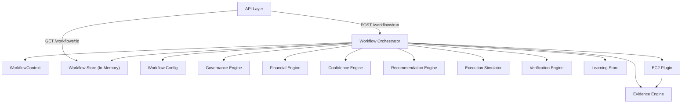

# Workflow Orchestrator — Sprint 7

**Project:** EWS AI Cloud Optimization Platform (SISU'M)

**Status:** Implemented (Sprint 7)

**Depends On:** `01-architecture-specification.md`, `05-engine-implementation-guide.md`, `02-api-specification.md`

---

## 1. Purpose

The Workflow Orchestrator coordinates the complete optimization lifecycle without implementing optimization logic. Sprint 7 hardens it into a production-ready workflow engine with explicit states, context tracking, failure management, retry structure, and observability.

---

## 2. Architecture Diagram



---

## 3. Workflow Lifecycle

Every optimization workflow follows this sequence:

```text
INITIALIZED
    ↓
EVIDENCE_COLLECTION
    ↓
GOVERNANCE_EVALUATION
    ↓
FINANCIAL_ANALYSIS
    ↓
CONFIDENCE_ANALYSIS
    ↓
RECOMMENDATION_GENERATION
    ↓
EXECUTION (simulated)
    ↓
VERIFICATION
    ↓
OUTCOME_STORAGE (learning)
    ↓
COMPLETED
```

On failure at any stage, the workflow transitions to `FAILED` and records the failed stage.

---

## 4. State Transitions

| Execution State | Workflow Stage | Prerequisite Stages |
|---|---|---|
| `initialized` | — | — |
| `evidence_collection` | evidence | — |
| `governance_evaluation` | governance | evidence |
| `financial_analysis` | financial | governance |
| `confidence_analysis` | confidence | financial |
| `recommendation_generation` | recommendation | confidence |
| `execution` | execution | recommendation |
| `verification` | verification | execution |
| `outcome_storage` | learning | verification |
| `completed` | — | all enabled stages |
| `failed` | — | stage that failed |

---

## 5. WorkflowContext

`WorkflowContext` is the single source of truth during execution. It carries:

- Identity: `workflowId`, `plugin`, `provider`, `region`, `mode`
- Lifecycle: `status`, `executionState`, `completedStages`, `failedStages`
- Stage outputs: `candidate`, `evidence`, `governance`, `financialImpact`, `confidence`, `recommendation`, `execution`, `observation`, `verification`
- Failure: `failure`, `retry`

---

## 6. Failure Handling

When a stage fails:

1. The orchestrator records a `WorkflowFailure` with `failedStage`, `error`, and `timestamp`.
2. Retry state is updated (`attemptCount`, `failedAttempts`, `status`).
3. Subsequent stages are not executed.
4. The workflow status becomes `failed`.
5. Structured logs emit `Stage failed` and `Workflow completed` with failure status.

Example failure response:

```json
{
  "workflowId": "wf-m3k2j1",
  "status": "failed",
  "executionState": "failed",
  "failedStages": ["evidence"],
  "failure": {
    "failedStage": "evidence",
    "executionState": "evidence_collection",
    "error": {
      "engine": "Evidence Engine",
      "code": "EVIDENCE_INCOMPLETE",
      "reason": "Missing utilization metrics"
    },
    "timestamp": "2026-07-09T10:00:00.000Z"
  },
  "retry": {
    "maxRetries": 3,
    "attemptCount": 1,
    "status": "retryable",
    "failedAttempts": []
  }
}
```

---

## 7. Retry Structure

Retry architecture is ready for future distributed retry policy:

- `MAX_RETRIES = 3` (configurable via `WorkflowConfig`)
- `retry.status`: `none` | `retryable` | `exhausted`
- `failedAttempts[]`: history of failed stage attempts

No distributed queues are implemented in MVP.

---

## 8. Configuration

`WorkflowConfig` controls behavior without hardcoding:

| Setting | Default | Purpose |
|---|---|---|
| `enabledStages` | all stages | Stage gating |
| `maxRetries` | 3 | Retry limit |
| `timeouts.*` | placeholders | Future timeout enforcement |
| `featureFlags.enableExecution` | true | Skip execution in dry-run |
| `featureFlags.enableLearning` | true | Skip learning store in dry-run |

Dry-run mode (`mode: "dry-run"`) stops after recommendation generation.

---

## 9. Validation Layer

Before every engine call, the orchestrator validates:

- Required inputs exist for the target stage
- Prerequisite stages completed successfully
- No prior failed stages exist
- Stage is enabled in configuration

Example: Financial Engine is not called if Governance failed.

---

## 10. API Endpoints

### `POST /api/v1/workflows/run`

Start a full optimization workflow.

**Request:**

```json
{
  "plugin": "ec2",
  "mode": "full",
  "resourceId": "i-mock-001",
  "region": "us-east-1"
}
```

**Response (201):**

```json
{
  "success": true,
  "data": {
    "workflowId": "wf-m3k2j1",
    "status": "completed",
    "executionState": "completed",
    "durationMs": 42,
    "completedStages": ["evidence", "governance", "financial", "confidence", "recommendation", "execution", "verification", "learning"],
    "failedStages": [],
    "candidate": { "resourceId": "i-mock-001", "resourceType": "ec2", "region": "us-east-1" },
    "recommendation": { "status": "RECOMMENDED", "summary": "...", "reason": "..." },
    "financialImpact": { "monthlySavings": 26.6, "annualSavings": 319.2, "status": "ESTIMATED" },
    "verification": { "status": "verified" }
  }
}
```

### `GET /api/v1/workflows/:id`

Fetch full workflow record including context and result.

### `GET /api/v1/workflows/status/:id`

Fetch workflow status summary with completed/failed stages.

---

## 11. Structured Logging

Every workflow emits structured JSON logs:

| Event | Fields |
|---|---|
| Workflow started | `workflowId`, `plugin`, `stage`, `status` |
| Stage started | `workflowId`, `stage`, `operation` |
| Stage completed | `workflowId`, `stage`, `durationMs`, `status` |
| Stage failed | `workflowId`, `stage`, `status: failed` |
| Workflow completed | `workflowId`, `durationMs`, `status` |

---

## 12. Folder Structure

```text
backend/orchestrator/
├── index.ts
├── workflow.orchestrator.ts   # Pipeline and stage execution
├── workflow.types.ts          # Context, result, metadata types
├── workflow.config.ts         # Configuration and feature flags
├── workflow.store.ts          # In-memory workflow tracking
├── workflow.validator.ts      # Stage prerequisite validation
├── workflow.retry.ts          # Retry state management
└── workflow.errors.ts         # Workflow-specific errors
```

---

## 13. Testing

Tests live under `backend/tests/`:

- `integration/workflow.orchestrator.test.ts` — full lifecycle and stage failures
- `unit/workflow.validator.test.ts` — validation layer

Run tests:

```bash
cd backend && npm test
```

---

## 14. Architectural Compliance

| Rule | Status |
|---|---|
| Orchestrator coordinates only | ✔ |
| No optimization logic in orchestrator | ✔ |
| No direct AWS SDK calls | ✔ |
| Engines called in correct sequence | ✔ |
| Provider abstraction maintained | ✔ |
| Layer boundaries preserved | ✔ |

---

## 15. Future Work (Not Sprint 7)

- DynamoDB persistence for workflow history
- Distributed retry with EventBridge / Step Functions
- `POST /workflows/:id/retry` endpoint
- Workflow timeout enforcement
- Authentication and RBAC
