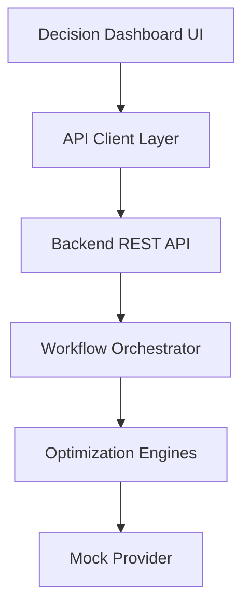

# Frontend Integration — Sprint 8

**Project:** EWS AI Cloud Optimization Platform (SISU'M)

**Status:** Implemented (Sprint 8)

---

## 1. Architecture



The frontend is a **presentation layer only**. It never calculates savings, evaluates governance, or generates recommendations.

---

## 2. Folder Structure

```text
frontend/
├── index.html                 # Decision Dashboard entry
├── package.json
├── vite.config.ts
├── src/
│   ├── api/
│   │   ├── client.ts          # Base fetch + error handling
│   │   └── workflowApi.ts     # Workflow endpoint client
│   ├── types/
│   │   └── index.ts           # Backend-synced types
│   ├── components/
│   │   ├── OptimizationOverview.ts
│   │   ├── CandidateCard.ts
│   │   ├── EvidenceStatus.ts
│   │   ├── GovernancePanel.ts
│   │   ├── FinancialImpactCard.ts
│   │   ├── ConfidenceIndicator.ts
│   │   ├── RecommendationCard.ts
│   │   ├── VerificationPanel.ts
│   │   ├── WorkflowProgress.ts
│   │   └── StateMessage.ts
│   ├── pages/
│   │   └── DecisionDashboard.ts
│   ├── styles/
│   │   └── dashboard.css
│   └── main.ts
└── portal/                    # Legacy demo portal (unchanged)
```

---

## 3. API Integration

| Endpoint | Purpose |
|---|---|
| `POST /api/v1/workflows/run` | Start optimization workflow |
| `GET /api/v1/workflows/:id` | Fetch full decision package |
| `GET /api/v1/providers/mock/instances` | List mock candidates |
| `GET /api/v1/health` | Backend connectivity check |

---

## 4. Component Responsibilities

| Component | Displays |
|---|---|
| `OptimizationOverview` | Total candidates, ready count, savings, confidence |
| `CandidateCard` | Resource type, current/recommended config |
| `EvidenceStatus` | Telemetry, validation, evidence completeness |
| `GovernancePanel` | Readiness score, policy pass/fail |
| `FinancialImpactCard` | Costs and savings from Financial Engine |
| `ConfidenceIndicator` | Confidence score and explanation |
| `RecommendationCard` | Recommendation status and business reason |
| `VerificationPanel` | Execution and verification outcomes |
| `WorkflowProgress` | Completed/failed workflow stages |
| `StateMessage` | Loading, error, empty, success states |

---

## 5. Running Locally

```bash
# Terminal 1 — Backend
cd backend && npm run dev

# Terminal 2 — Frontend
cd frontend && npm install && npm run dev
```

Open `http://localhost:5173` and click **Analyze Environment**.

---

## 6. Testing

```bash
cd frontend && npm test
```

Tests cover format utilities and component rendering with jsdom.

---

## 7. Rules

- UI components never call `fetch` directly — use `workflowApi.ts`
- All metrics come from backend API responses
- Mock Mode uses backend Mock Provider only
- No authentication, billing, or AWS login in MVP
