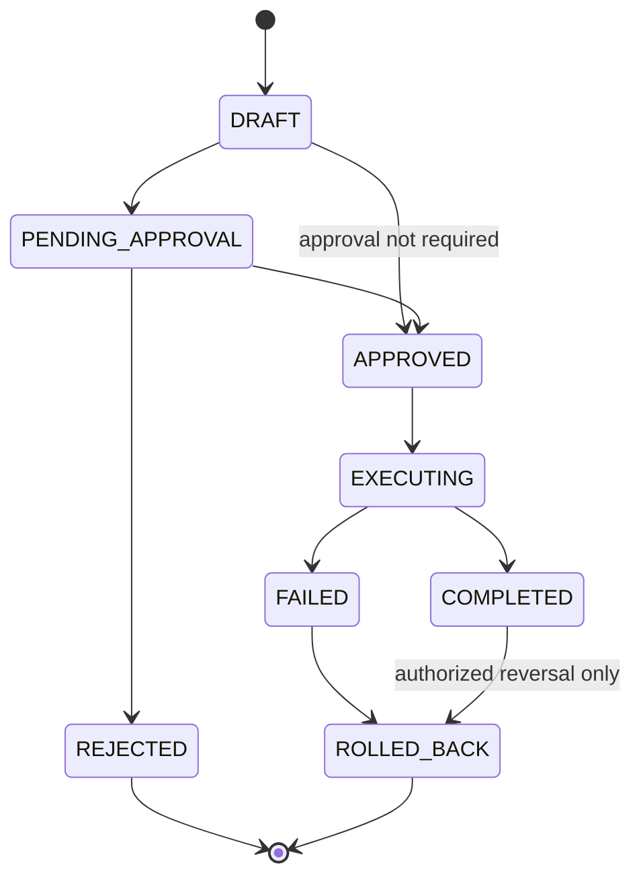

# Sprint 12.5 — Execution plan data model

## Scope

Sprint 12.5 Engineer 1 adds durable persistence for **execution plans** and **append-only execution history**:
tenant-scoped records, optimistic locking, approval-state fields, lifecycle validation, and DynamoDB access patterns using **Query/GetItem only**.

## Non-goals

- No HTTP APIs or Express routes
- No real AWS resource execution (EC2/RDS/Lambda changes)
- No changes to the mock `ExecutionSimulator` behavior in `backend/execution/`
- No workflow orchestration wiring
- No authorization route for post-completion rollback (see lifecycle below)

## Model

- **ExecutionPlanRecord** — versioned, tenant-owned plan with steps, rollback plan, risk, and approval metadata.
- **ExecutionHistoryRecord** — append-only audit events (no updates/deletes, no optimistic version field).

## Lifecycle

Same-state transitions are rejected. `DRAFT` cannot jump to `EXECUTING`. `PENDING_APPROVAL` cannot jump to `COMPLETED`.

### Post-completion rollback (`COMPLETED` → `ROLLED_BACK`)

This transition is **persistence-only** and represents an **explicitly authorized reversal** of a previously completed execution plan (for example, a governed undo recorded after completion). The repository validates that the transition is structurally allowed; it does **not** implement the authorization route, approval workflow, or real rollback execution. Engineer 2+ must enforce who may authorize reversal before calling `transitionStatus`.

## Approval paths

| approvalRequired | Path |
| --- | --- |
| true | `DRAFT` → `PENDING_APPROVAL` → `APPROVED` (via `recordApprovalDecision`) |
| false | `DRAFT` → `APPROVED` (direct `transitionStatus` when policy permits) |

## Approval-state rules

| approvalRequired | Initial approvalStatus | EXECUTING allowed when |
| --- | --- | --- |
| false | NOT_REQUIRED | plan reaches EXECUTING via lifecycle |
| true | PENDING | planStatus APPROVED **and** approvalStatus APPROVED |

Rejection sets `planStatus=REJECTED`, `approvalStatus=REJECTED`, and persists `rejectedBy`, `rejectedAt`, optional `rejectionReason`. Approval persists `approvedBy`, `approvedAt`.

## DynamoDB table

Dedicated table **`sisum-execution-plans-${Environment}`** (one table per resource type, consistent with Sprint 11/12).

Plans and history share the table with distinct sort-key prefixes.

### Primary keys

| Entity | PK | SK |
| --- | --- | --- |
| Plan | `TENANT#<tenantId>` | `EXECUTION#<executionId>` |
| History | `TENANT#<tenantId>` | `EXECUTION_HIST#<executionId>#CREATED_AT#<iso>#<historyId>` |

### GSI access patterns

| Index | PK | SK | Use |
| --- | --- | --- | --- |
| gsi1 | `TENANT#<tenantId>#WORKFLOW#<workflowId>` | `CREATED_AT#<iso>#EXECUTION#<executionId>` | List by workflow |
| gsi2 | `TENANT#<tenantId>#EXECUTION_STATUS#<status>` | `CREATED_AT#<iso>#EXECUTION#<executionId>` | List by status |

Tenant listing queries the base table: `pk = TENANT#...` and `begins_with(sk, "EXECUTION#")`.

History listing queries: `begins_with(sk, "EXECUTION_HIST#<executionId>#")`.

## Optimistic locking

Plan updates require `expectedVersion`. Condition: `attribute_exists(pk) AND version = :expectedVersion`. Successful updates increment `version` once and refresh `updatedAt`. Conflicts map to `RepositoryConflictError`. Creates use `attribute_not_exists(pk/sk)` → `RepositoryAlreadyExistsError`.

Status transitions update `gsi2pk` atomically with `planStatus`.

## History append model

`PutItem` with `attribute_not_exists(pk/sk)`. Duplicate `historyId` for the same execution is rejected. No update/delete APIs.

## Pagination

Scoped tokens (`tenantId` + query `scope`) via `encodeScopedNextToken` / `decodeScopedNextToken`. Tokens cannot be reused across tenant, workflow, status, or history queries.

## Tenant isolation

All repository methods require `tenantId`. `getById(tenantId, executionId)` uses composite keys; cross-tenant reads return `undefined`.

## IAM (Lambda)

Allowed on execution plans table ARN and indexes: `GetItem`, `PutItem`, `UpdateItem`, `Query`, plus existing transact actions on the shared business policy. **No** `Scan` or `dynamodb:*`.

Environment variable: `EXECUTION_PLANS_TABLE_NAME`.

## Failure behavior

Conditional failures become repository-domain errors. Raw AWS SDK errors are not exposed to callers.

## Future integration

- **Engineer 2** — execution APIs, authorization middleware (including post-completion reversal authorization), orchestration hooks calling `ExecutionPlanRepository` / history append.
- **Engineer 3** — real AWS execution adapters reading approved plans; must not persist SDK clients in DynamoDB items.
