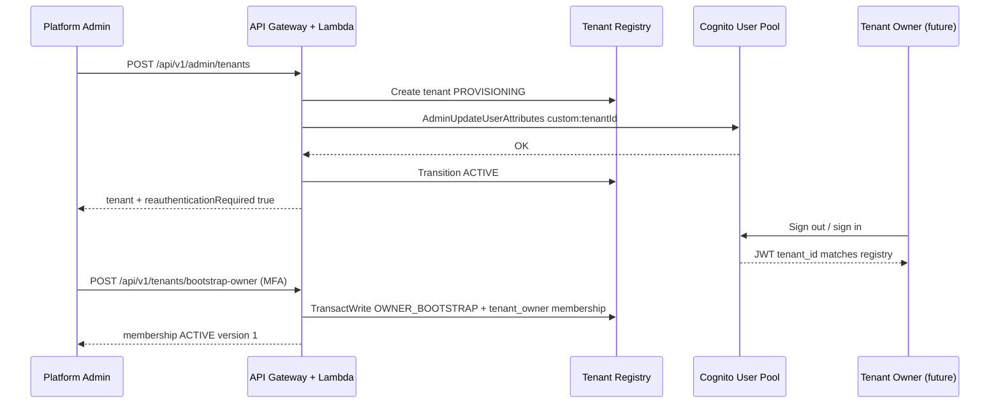
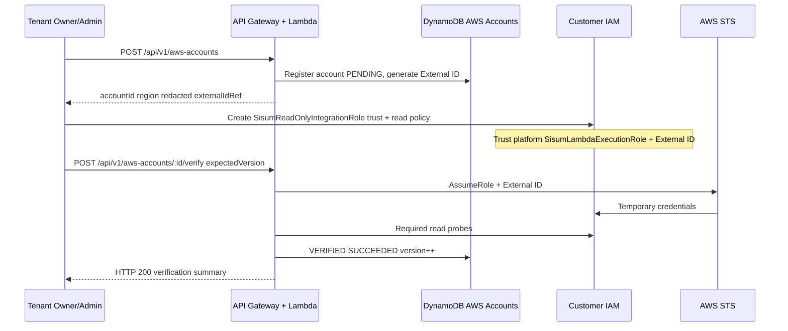
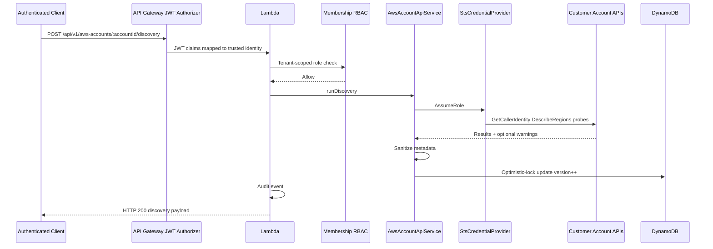
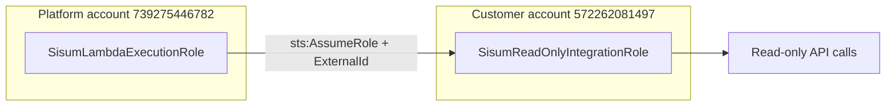

# Sprint 13 — Live AWS integration architecture

**Sprint:** Live AWS Account Integration & Evidence Collection Foundation
**Status:** Implemented on `main`; production validated (see [production validation report](../validation/sprint-13-production-validation-report.md))

This document complements [aws-account-discovery.md](./aws-account-discovery.md) and [aws-integration-validation-readiness.md](../validation/aws-integration-validation-readiness.md).

---

## Boundaries and responsibilities

| Party | Responsibility |
|-------|----------------|
| Customer | IAM role, trust policy (External ID + platform principal), read policy scope |
| Platform | Tenant registry, membership RBAC, STS AssumeRole, verification/discovery, sanitized persistence |
| AWS | STS, IAM enforcement, service APIs |

**Never persisted by the platform:** customer access keys, session tokens, MFA codes, Authorization headers, full External ID in client-visible API payloads (stored server-side only; responses redacted).

**Persisted (sanitized):** account IDs, regions, verification/discovery status, capability summaries, warnings, timestamps, version, audit metadata.

---

## A. Tenant onboarding and first-owner flow

Notes:

- Bootstrap is **one-time**; second call returns **409**.
- Bootstrap requires **platform admin** + **privileged MFA**.
- Tenant must be **ACTIVE** before bootstrap.

---

## B. AWS account onboarding flow

---

## C. Discovery flow

**Identity safety:** GetCallerIdentity account ID must match registered `accountId`. Mismatch fails safely and must not incorrectly mark the account VERIFIED.

**HTTP method:** Discovery is **`POST`**, not GET.

---

## D. Trust relationship

- Platform Lambda assumes **customer role**; customer does not hold platform credentials.
- External ID mitigates confused deputy when multiple customers use similar role names.
- Validation evidence used managed read-only breadth; **production customers should use a narrower policy** (see [security validation](../security/sprint-13-security-validation.md)).

---

## Component map

| Layer | Components |
|-------|------------|
| HTTP | `aws-account.routes.ts`, `tenant-bootstrap.routes.ts`, `tenant-admin.routes.ts` |
| Domain | `aws-account-api-service.ts`, discovery in `execution/adapters/sts/` |
| Credentials | STS adapter, in-memory cache keyed by tenant + role |
| Data | `dynamodb-aws-account-repository.ts`, membership repositories |
| Auth | `privileged-mfa.ts`, trusted identity in `lambda.ts` |

---

## Related documentation

- [Sprint 13 closeout](../handoff/sprint-13-closeout.md)
- [Operations runbook](../operations/sprint-13-live-aws-integration-runbook.md)
- [Tenant onboarding runbook](../operations/tenant-onboarding-runbook.md) (if present — align steps with #190)
