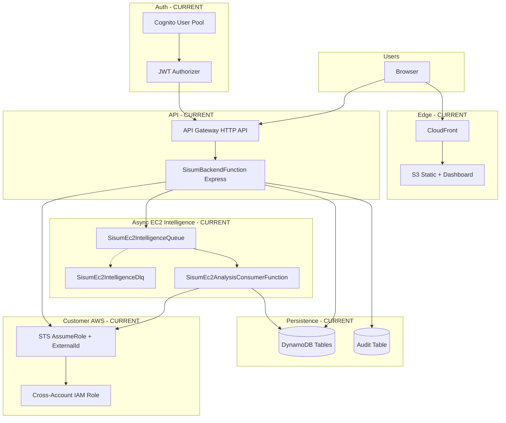
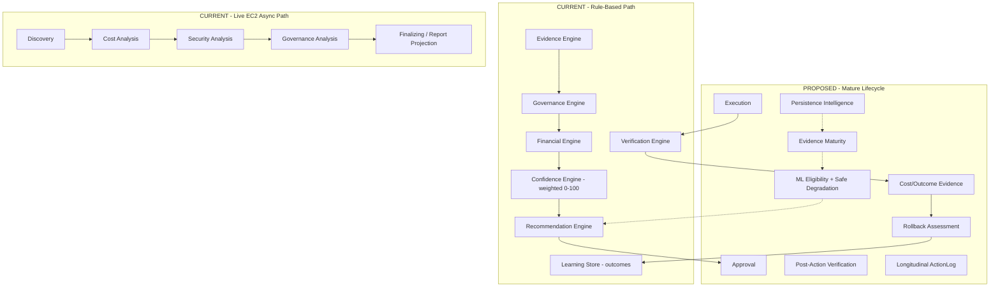

# EWS / SISU'M Enterprise Intelligent Optimization Handbook

| Field | Value |
|-------|-------|
| **Project** | EWS AI Cloud Optimization Platform |
| **Internal platform name** | SISU'M |
| **Document** | Enterprise Intelligent Optimization Handbook |
| **Version** | 2.0 |
| **Status** | Living Engineering Handbook |
| **Last updated** | TBD — update when merged |
| **Current implementation source** | Repository code (`backend/`, `frontend/`, `infrastructure/`, `docs/validation/`), SAM templates, GitHub workflows, and automated tests |
| **Purpose** | Single enterprise engineering source of truth for current capabilities, security posture, intelligence architecture, research/commercial gaps, and the path toward controlled optimization autonomy |

---

## 1. Executive Summary

### Current State

SISU'M is a **TypeScript cloud optimization decision platform** with:

- A **vanilla TypeScript + Vite** dashboard and marketing frontend hosted on **S3 + CloudFront**
- An **Express** application running on **AWS Lambda** behind **API Gateway HTTP API** with **Cognito JWT** authorization
- **DynamoDB** durable persistence for tenants, memberships, workflows, reports, learning, verification, execution plans/runs, AWS accounts, EC2 inventory, and EC2 async intelligence jobs
- **Cross-account AWS integration** via **STS AssumeRole** with tenant-specific **External ID**
- **Live EC2 intelligence** (discovery, cost, security, governance stages) via an **SQS-backed async job pipeline** and dedicated consumer Lambda
- A **workflow orchestrator** with rule-based **evidence, governance, financial, confidence, recommendation, verification, and learning** engines
- **Execution plans and runs** with approval gates, orchestrated execution modes, post-action verification, and rollback support
- Extensive **automated testing** (unit, integration, security, contract, performance) and **GitHub Actions** deployment via **OIDC**

The platform is **not** a simple recommendation dashboard. It implements substantial foundations for an evidence-driven optimization lifecycle, but **machine learning inference is not implemented** in the current codebase.

### Target State

A genuinely intelligent, **evidence-driven ML cloud optimization recommendation platform** where every material transition (persistence → maturity → governance → confidence → decision → approval → action → verification → outcome → rollback assessment → longitudinal learning) is **auditable**, **tenant-isolated**, and **human-governed** until explicitly qualified for controlled autonomy.

### Gaps

- Longitudinal **persistence intelligence** (material-change tracking, `persistence_hours`) is **proposed**, not implemented
- **Evidence maturity** taxonomy (`MATURE` / `PARTIAL` / `IMMATURE`) is **proposed**
- **ML safe degradation** and **ML eligibility** are **proposed**
- Workflow **AWS Provider** layer is a **stub**; live EC2 uses a separate STS path
- **DLQ reconciliation** for abandoned durable async jobs is **partially implemented** (DLQ exists; no DLQ consumer terminalizes jobs)
- Enterprise security services (WAF, GuardDuty, Security Hub, Config, Access Analyzer) are **roadmap**, not fully deployed in-repo

### Engineering Direction

Execute the **Four-Sprint Intelligence Convergence Programme** (Section 23) while preserving commercial governance controls and documenting research/commercial mappings at invariant level only.

---

## 2. Source of Truth and Documentation Rules

### Current State

| Rule | Implementation |
|------|----------------|
| Code is authoritative for **CURRENT** status | TypeScript sources, SAM templates, repository contracts, tests |
| Architecture docs under `docs/architecture/` | Historical and detailed specifications; may lag code |
| Validation reports under `docs/validation/` | Production and sprint validation evidence |
| This handbook | Living consolidation; must be updated with material engineering changes |

### Status labels

Use these labels consistently throughout the handbook. **Do not upgrade or downgrade a classification merely for wording** — change status only when repository evidence changes.

| Label | Meaning | When to use |
|-------|---------|-------------|
| **CURRENT** | Verified in repository code, tests, or infrastructure | Behaviour exists and is substantiated today |
| **PARTIALLY IMPLEMENTED** | Exists but incomplete, mock-default, dual-path, or split across stacks | Some capability is live; gaps are documented |
| **PROPOSED** | Target design for intelligence-convergence sprints | Engineering direction with defined acceptance criteria; not yet built |
| **PLANNED** | Documented in architecture/roadmap but not yet scheduled as sprint deliverables | Future work without detailed sprint contract yet |
| **NOT VERIFIED** | Cannot be fully substantiated by repository or automated validation evidence | Claim may be operationally true but is not proven in-repo |

**Distinction:** **PROPOSED** items have explicit sprint intent and semantic contracts; **PLANNED** items are directional (roadmap, additional plugins, security services) without a committed sprint gate.

### Documentation rule

> When implementation changes materially, update the relevant documentation in the same engineering change.
> Do not document planned behaviour as implemented behaviour.

---

## 3. Current Platform State

### Current State — capability matrix

| Area | Status | Repository evidence |
|------|--------|----------------------|
| Frontend dashboard | **CURRENT** | `frontend/dashboard/`, Vite multi-page build |
| Backend API | **CURRENT** | `backend/index.ts`, Express routes |
| Lambda deployment | **CURRENT** | `backend/lambda.ts`, `backend/template.yaml` |
| Cognito authentication | **CURRENT** | JWT authorizer, `frontend/dashboard/src/auth/` |
| Tenant RBAC | **CURRENT** | `backend/auth/tenant-roles.ts`, membership repository |
| Platform RBAC | **CURRENT** | `backend/auth/roles.ts` (viewer/analyst/admin) |
| Privileged MFA policy | **PARTIALLY IMPLEMENTED** | `backend/auth/privileged-mfa.ts`; claim issuance depends on Cognito config |
| DynamoDB persistence | **CURRENT** | 13+ SAM tables, DynamoDB repositories |
| AWS account onboarding | **CURRENT** | External ID, verify, STS AssumeRole |
| EC2 discovery (live) | **CURRENT** | `backend/cloud-intelligence/`, discovery API service |
| EC2 cost intelligence | **CURRENT** | `backend/cloud-intelligence/ec2-cost/` |
| EC2 security intelligence | **CURRENT** | Security analysis services and routes |
| EC2 async jobs | **CURRENT** | SQS producer/consumer, job repository, frontend polling |
| Workflow orchestrator | **CURRENT** | `backend/orchestrator/workflow.orchestrator.ts` |
| Rule-based engines | **CURRENT** | `backend/engines/` |
| Execution + rollback | **CURRENT** | `backend/execution/`, execution API |
| Verification engine | **CURRENT** | `backend/engines/verification/` |
| Learning store | **PARTIALLY IMPLEMENTED** | Outcome logging; not ML training |
| Reporting | **CURRENT** | Workflow reports + EC2 async report projection |
| ML inference | **PLANNED** | No ML libraries or model serving in `backend/engines/` |
| EC2 plugin only | **CURRENT** | `backend/plugins/index.ts` — EC2 registered |
| AWS Provider (workflow) | **PARTIALLY IMPLEMENTED** | Stub throws; mock default |
| Monitoring alarms | **PARTIALLY IMPLEMENTED** | Separate `infrastructure/monitoring/template.yaml` |
| CI full test on every PR | **PARTIALLY IMPLEMENTED** | `ci.yml` structure checks; full tests in deploy workflows |

### Target State

Full multi-plugin, multi-cloud optimization platform with ML-assisted ranking under governance, complete persistence intelligence, and enterprise security service integration.

---

## 4. Enterprise Architecture

### Current State — deployment topology



### Intelligence control plane — current vs target



**Legend:** Solid boxes in **current** subgraphs are implemented. Dotted **proposed** nodes are target capabilities.

### Architectural layers (CURRENT)

| Layer | Location | Responsibility |
|-------|----------|----------------|
| API | `backend/api/routes/` | HTTP validation, auth, tenant context |
| Services | `backend/services/` | Domain orchestration, EC2 async producer/API |
| Engines | `backend/engines/` | Evidence → recommendation pipeline |
| Orchestrator | `backend/orchestrator/` | Multi-stage workflow |
| Repositories | `backend/repositories/` | Persistence contracts + DynamoDB/mock |
| Execution | `backend/execution/` | Plans, runs, adapters, rollback |
| Cloud intelligence | `backend/cloud-intelligence/` | Live EC2 analyzers |
| Async jobs | `backend/async-jobs/`, `backend/ec2-analysis-consumer/` | Queue messages, consumer batch |
| Frontend | `frontend/dashboard/src/` | Live dashboard, EC2 async UI, reports |

### Target State

Unified intelligence plane where workflow and live EC2 paths converge on shared persistence, maturity, confidence, and action lifecycle semantics.

### Gaps

- Dual paths: workflow engines vs live EC2 STS path
- Provider abstraction stubbed for AWS in workflow mode

---

## 5. Security and Tenant Isolation

### Current State

| Control | Status | Evidence |
|---------|--------|----------|
| JWT-only API access (except health) | **CURRENT** | `backend/template.yaml` SisumJwtAuthorizer |
| Trusted tenant from JWT `tenant_id` only | **CURRENT** | `backend/auth/tenant.ts` |
| Cross-tenant access denied without existence leak | **CURRENT** | `backend/auth/tenant-guard.ts` |
| Tenant-scoped DynamoDB keys | **CURRENT** | `backend/repositories/dynamodb/base-dynamodb-repository.ts` |
| Ownership index for global resources | **CURRENT** | `dynamodb-ownership-repository.ts` |
| RBAC — platform + tenant roles | **CURRENT** | `roles.ts`, `tenant-roles.ts`, `require-tenant-role.ts` |
| Privileged MFA fail-closed | **CURRENT (policy)** | `privileged-mfa.ts`, execution approve/execute/rollback |
| STS ExternalId on AssumeRole | **CURRENT** | `aws-account-api-service.ts`, trust policy builder |
| No credentials in queue messages | **CURRENT** | `ec2-intelligence-queue-message.ts` contract |
| Audit events | **CURRENT** | `backend/audit/` |
| Tenant enforcement mode | **PARTIALLY IMPLEMENTED** | Default `compatibility` with optional fallback tenant in SAM |

### Target State

Strict multi-tenant mode in production, comprehensive AWS security services, WAF at edge, continuous least-privilege verification with policy evidence (not probe-only).

### Gaps

| Gap | Status |
|-----|--------|
| Least-privilege **assurance** on customer roles | **NOT VERIFIED** — successful read probes do not prove absence of write permissions (`docs/security/aws-assumerole-least-privilege.md`) |
| WAF / GuardDuty / Security Hub / Config | **PLANNED** — roadmap references; not fully in application SAM |
| Strict tenant mode as production default | **PLANNED** — configuration-dependent |
| MFA claim coverage all auth flows | **PARTIALLY IMPLEMENTED** — validation reports note gaps |

### Engineering Direction

Preserve fail-closed tenant and MFA policies. Harden production to `strict` tenant enforcement. Expand security validation beyond read-probe success.

---

## 6. Durable Persistence Architecture

### Current State

**DynamoDB tables** (SAM — `backend/template.yaml`):

| Table | Primary use |
|-------|-------------|
| `sisum-tenants-*` | Tenant registry |
| `sisum-memberships-*` | Tenant membership / roles |
| `sisum-invitations-*` | Invitations |
| `sisum-ownership-*` | Cross-tenant resource ownership index |
| `sisum-aws-accounts-*` | Registered accounts, External ID, verification state |
| `sisum-cloud-resources-*` | EC2 discovery inventory |
| `sisum-async-jobs-*` | EC2 async jobs + events + idempotency |
| `sisum-workflows-*` | Workflow state |
| `sisum-reports-*` | Optimization reports |
| `sisum-learning-*` | Learning/outcome records |
| `sisum-verifications-*` | Verification outputs |
| `sisum-execution-plans-*` | Execution plans, runs, history (single-table pattern) |
| `sisum-audit-*` | Audit persistence |

**Patterns (CURRENT):**

- Repository contracts in `backend/repositories/contracts/`
- DynamoDB implementations in `backend/repositories/dynamodb/`
- Mock fallbacks for local dev in `backend/repositories/mock/`
- Optimistic locking via `version` + `expectedVersion` on updates
- Idempotency records for EC2 async jobs and execution operations
- Append-only event patterns for jobs and execution history

### Target State

Longitudinal persistence intelligence with fingerprinted recommendation history, material-change detection, and out-of-order observation handling.

### Gaps

Persistence intelligence model (`NEW`, `STABLE`, `CHANGED`, `MISSING_PREVIOUS`, `persistence_hours`) — **PROPOSED**, not found in repository code.

---

## 7. AWS Account Integration

### Current State

| Step | Status | Evidence |
|------|--------|----------|
| Register account | **CURRENT** | Generates tenant-scoped External ID |
| Trust policy template | **CURRENT** | `aws-account-integration-trust-policy.ts` |
| Permission verification | **CURRENT** | Read-only probes (EC2, CloudWatch, etc.) |
| Lifecycle | **CURRENT** | PENDING → VALIDATING → VERIFIED / SUSPENDED / DELETED |
| STS AssumeRole | **CURRENT** | Mandatory ExternalId; temporary credentials |
| Discovery metadata | **CURRENT** | Post-verify account discovery |
| Credential hygiene | **CURRENT** | Not stored in DDB, logs, audit, or API responses |

**Platform Lambda permissions:** `sts:AssumeRole` only on customer role ARNs — customer account permissions live on the **customer cross-account role**.

### Target State

Continuous permission drift detection, policy-evidence-based least-privilege assurance, automated remediation guidance.

### Gaps

`leastPrivilegeAssurance: NOT_VERIFIED` unless future policy-evidence workflows implemented — **documented explicitly** in security docs.

---

## 8. Asynchronous Intelligence Architecture

### Current State

**EC2 async intelligence jobs** — **CURRENT** (`docs/architecture/ec2-async-intelligence-jobs.md`):

| Component | Detail |
|-----------|--------|
| API | `POST /analysis/ec2/start` → 202 + jobId |
| Producer | Idempotent job row + SQS enqueue |
| Queue | `sisum-ec2-intelligence-{env}` |
| DLQ | `sisum-ec2-intelligence-dlq-{env}`, maxReceiveCount **5** |
| Consumer | `SisumEc2AnalysisConsumerFunction` |
| Correlation | `correlationId` on jobs and audit events |

**Job stages (CURRENT)** — `backend/services/ec2-async-job-stage-order.ts`:

```
ENQUEUE → DISCOVERY → COST_ANALYSIS → SECURITY_ANALYSIS → GOVERNANCE_ANALYSIS → FINALIZING → COMPLETE
```

**Job status (CURRENT):** `QUEUED` → `RUNNING` → `SUCCEEDED` / `PARTIAL` / `FAILED`

**Execution fencing (CURRENT):** Stage-run leases (`leaseExpiresAt`, `executionOwnerId`) on discovery/cost/security runs — **not** on durable job row.

**Scope blocking (CURRENT):** Same-scope duplicate suppression uses stage-proof-aware blocking (`isScopeBlocking` API field) — **PARTIALLY IMPLEMENTED** on branch/fix paths; verify merged status in deployment.

**Frontend (CURRENT):** Polling, history, latest-per-scope grouping, terminal history refresh reconciliation.

### Target State

DLQ reconciliation terminalizing durable jobs, full observability dashboards, mid-pipeline persistence intelligence integration.

### Gaps

| Gap | Status |
|-----|--------|
| DLQ consumer / durable job reconciliation | **PLANNED** — DLQ exists; no consumer updates abandoned `RUNNING` jobs |
| Orphaned `QUEUED` if message lost | **PLANNED** — documented limitation |
| Job-level `PARTIAL` at terminal completion | **NOT VERIFIED** as emitted — unit test documents gap |

---

## 9. Intelligent Optimization Decision Pipeline

### Current State

**Principle (CURRENT in architecture docs and orchestrator):**

The platform objective is an **evidence-driven cloud optimization decision platform**, not a static recommendation list.

### Decision intelligence dependency (canonical lifecycle)

Downstream stages **must not manufacture missing upstream evidence**. Each transition may only consume outputs from prior stages or explicitly record **insufficient evidence** with reason codes — never silently infer missing inputs.

```mermaid
flowchart LR
  E[Evidence]
  P[Persistence]
  M[Evidence Maturity]
  G[Governance]
  C[Confidence]
  ME[ML Eligibility]
  MR[ML / Rules]
  R[Recommendation]
  A[Approval]
  X[Execution]
  V[Verification]
  CO[Cost / Outcome Evidence]
  RB[Rollback Assessment]
  L[Longitudinal Learning]

  E --> P --> M --> G --> C --> ME --> MR --> R --> A --> X --> V --> CO --> RB --> L
```



| Stage | Status (summary) |
|-------|------------------|
| Evidence | **CURRENT** — evidence engine + EC2 live collectors |
| Persistence | **PARTIALLY IMPLEMENTED** — reports/jobs; full persistence intelligence **PROPOSED** (Sprint 1) |
| Evidence Maturity | **PROPOSED** (Sprint 2) |
| Governance | **CURRENT** — rule engine |
| Confidence | **CURRENT** — weighted deterministic 0–100 |
| ML Eligibility | **PROPOSED** (Sprint 3) |
| ML / Rules | **CURRENT** — rules only; ML **PLANNED** |
| Recommendation | **CURRENT** |
| Approval | **CURRENT** — execution plans |
| Execution | **CURRENT** — orchestrator |
| Verification | **CURRENT** — verification engine |
| Cost / Outcome Evidence | **PARTIALLY IMPLEMENTED** |
| Rollback Assessment | **PARTIALLY IMPLEMENTED** — rollback exists; tri-state assessment **PROPOSED** (Sprint 4) |
| Longitudinal Learning | **PARTIALLY IMPLEMENTED** — learning store |

### Canonical decision contracts (PROPOSED)

The handbook references conceptual contracts that describe decision semantics across the lifecycle:

| Contract | Sprint | Purpose |
|----------|--------|---------|
| `PersistenceAssessment` | 1 | Longitudinal persistence state and material-change semantics |
| `EvidenceMaturity` | 2 | Maturity classification and reason codes |
| `MLDecision` | 3 | Eligibility, execution outcome, and safe-degradation semantics |
| `RollbackAssessment` | 4 | Maintain / rollback / insufficient-evidence outcome |

> **Contract note:** These contracts define **semantic guarantees** rather than mandatory TypeScript property names. Existing repository contracts should be extended or adapted where appropriate rather than duplicated unnecessarily. They are **PROPOSED** — the exact interfaces do not exist in the repository today.

Every implemented transition should produce **auditable reason codes** where engines support them. **Gap:** not all lifecycle stages emit standardized reason codes yet.

### Target State

Full lifecycle with auditable transitions at every stage; ML participates only under eligibility and governance authority; no downstream stage invents upstream evidence.

---

## 10. Evidence Intelligence

### Current State

**Evidence Engine** — **CURRENT** (`backend/engines/evidence/evidence.engine.ts`):

- Collects and normalizes evidence for workflow pipeline
- Validates evidence completeness
- Feeds governance and confidence engines

**Live EC2 path** — **CURRENT**:

- Discovery inventory, CloudWatch metrics (cost), security findings as separate persisted runs

### Target State

Unified evidence model with provenance, observation windows, telemetry completeness scoring, and cost-evidence taxonomy.

### Gaps

Cross-path evidence normalization — **PARTIALLY IMPLEMENTED**

---

## 11. Persistence Intelligence

### Current State

**CURRENT behaviour:**

- Reports persisted to `sisum-reports-*` with ownership index
- EC2 async jobs persist pipeline state and events
- Learning store records outcomes per workflow
- Recommendation existence in a report **does not** equal longitudinal persistence intelligence

### Target State (PROPOSED)

**`PersistenceAssessment`** (conceptual contract — **PROPOSED**, not an existing TypeScript interface):

Persistence state model:

| State | Meaning |
|-------|---------|
| `NEW` | First observation of recommendation fingerprint |
| `STABLE` | Fingerprint unchanged over observation window |
| `CHANGED` | Material change detected |
| `MISSING_PREVIOUS` | Expected prior history absent |

Additional fields (conceptual — **not implemented**):

- `persistence_hours`
- `previousRecommendationReference`
- `currentRecommendationFingerprint` / `previousFingerprint`
- Timestamps for first seen / last changed
- Duplicate observation handling
- Out-of-order observation handling
- Idempotent persistence writes

> **Contract note:** `PersistenceAssessment` defines **semantic guarantees** rather than mandatory TypeScript property names. Existing repository contracts should be extended or adapted where appropriate rather than duplicated unnecessarily.

> Research-derived persistence methods — implementation subject to applicable IP authorization. Do not copy proprietary formulas into the commercial repository without authorization.

### Gaps

Entire persistence intelligence layer — **PROPOSED** (Sprint 1)

### Engineering Direction

Implement invariant-level persistence tracking without exposing unauthorized proprietary constants.

---

## 12. Evidence Maturity

### Current State

Governance readiness scoring exists (`governance.readiness.ts`) — **CURRENT** but **not** equivalent to enterprise evidence maturity taxonomy.

### Target State (PROPOSED)

**`EvidenceMaturity`** (conceptual contract — **PROPOSED**, not an existing TypeScript interface):

| Maturity | Meaning |
|----------|---------|
| `MATURE` | Sufficient observation window, telemetry completeness, cost evidence, consistency |
| `PARTIAL` | Usable with documented limitations |
| `IMMATURE` | Insufficient for high-confidence action |

System must emit **reason codes** explaining maturity classification.

Inputs (conceptual):

- Observation window
- Telemetry completeness
- Cost evidence availability
- Recommendation consistency
- ML eligibility (when applicable)
- Evidence provenance

> **Contract note:** `EvidenceMaturity` defines **semantic guarantees** rather than mandatory TypeScript property names. Existing repository contracts should be extended or adapted where appropriate rather than duplicated unnecessarily.

### Gaps

Formal `MATURE` / `PARTIAL` / `IMMATURE` — **PROPOSED** (Sprint 2)

---

## 13. Governance and Readiness

### Current State

**Governance Engine** — **CURRENT** (`backend/engines/governance/`):

- Policy evaluation
- Readiness calculation
- Blocks downstream stages on incomplete evidence
- Audit-friendly logging

**Commercial vs research mapping concept (REQUIRED):**

| Mapping | Meaning |
|---------|---------|
| **PRESERVED** | Commercial control retained; aligns with research intent |
| **IMPROVED** | Commercial implementation exceeds research prototype |
| **REPLACED** | Different mechanism, same invariant |
| **MISSING** | Research invariant not yet in commercial platform |

**Rule:** Do **not** delete commercial governance controls to match a research prototype. **Governance must remain authoritative over ML.**

### Target State

Explicit governance mapping table per invariant, reason codes on every block/allow decision, readiness integrated with evidence maturity.

### Gaps

Formal mapping documentation per research method — **PLANNED** (Sprint 2)

---

## 14. Confidence Intelligence

### Current State

**Confidence Engine** — **CURRENT** — deterministic weighted **0–100** score (`backend/engines/confidence/confidence.scoring.ts`):

| Criterion (examples) | Weight |
|------------------------|--------|
| Workload stability | 25 |
| Historical consistency | 20 |
| (additional criteria in code) | … |

Thresholds (`DEFAULT_CONFIDENCE_CONFIG`):

- `scoreHigh`: 80 → HIGH
- `scoreMedium`: 50 → MEDIUM
- Below → LOW

Status enum: `HIGH`, `MEDIUM`, `LOW` — **not** ML-derived.

### Target State

Preserve commercial baseline; add golden vectors, boundary tests, missing-data behaviour tests, configuration/version tracking, calibration, documented divergence from any research formulation.

**Do NOT automatically replace** the commercial model with a research formulation without explicit engineering qualification.

### Gaps

Golden decision vectors for confidence — **PROPOSED** (Sprint 2)

---

## 15. Machine Learning Architecture

### Current State

**No ML inference implementation** in `backend/engines/`. Learning store records outcomes — **not** model training.

Roadmap Phase 5 references AI-augmented intelligence — **PLANNED** (`docs/architecture/13-roadmap.md`).

### ML authority principle

> **ML is advisory intelligence, not an authorization mechanism.**

This principle is non-negotiable for all sprints:

- **ML cannot bypass governance.**
- **ML cannot bypass approval requirements.**
- **ML cannot directly authorize infrastructure changes.**
- **High confidence does not automatically authorize autonomous action.**
- **ML authority must be earned through verified historical performance** — not asserted by model output alone.

### Sprint 3 ML strategy (PROPOSED)

The objective of Sprint 3 is **not** to introduce a generic ML model merely for the sake of having ML. The objective is to establish a **safe, explainable ML participation contract**.

Before any production-authoritative ML decision path exists, ML must first become:

| Requirement | Meaning |
|-------------|---------|
| **Eligibility-aware** | Explicit `ML_ELIGIBLE` / `ML_INELIGIBLE` gating |
| **Evidence-dependent** | Cannot run without required upstream evidence and maturity |
| **Governance-constrained** | Governance remains authoritative over model output |
| **Auditable** | Every invoke, skip, and fallback produces durable reason codes |
| **Safely degradable** | `EXECUTED` / `SKIPPED` / `FAILED_SAFE` with deterministic fallback |
| **Independently verifiable** | Model output testable via golden vectors and failure injection |

The **first production ML implementation may therefore be intentionally narrow** — for example, candidate ranking or risk estimation under strict eligibility — rather than a broad end-to-end autonomous optimizer.

**Release gate:** Sprint 3 must **not** introduce production-authoritative ML decisions until **Sprint 1** (persistence foundation) and **Sprint 2** (maturity, governance mapping, confidence baseline) **release gates have passed**. See Section 23.

### Target State (PROPOSED)

**`MLDecision`** (conceptual contract — **PROPOSED**, not an existing TypeScript interface):

ML as a **controlled intelligence layer**:

**ML MUST NOT:**

- Bypass governance
- Bypass authorization or approval requirements
- Authorize infrastructure changes by itself
- Invent missing evidence
- Hide model failures
- Convert missing evidence into high confidence
- Treat high model confidence as automatic authorization to act

**ML SHOULD:**

- Prioritize candidates
- Predict optimization outcomes
- Estimate risk
- Detect patterns
- Improve ranking using verified outcomes
- Support future learning

> **Contract note:** `MLDecision` defines **semantic guarantees** rather than mandatory TypeScript property names. Existing repository contracts should be extended or adapted where appropriate rather than duplicated unnecessarily.

---

## 16. ML Safe Degradation

### Current State

**PROPOSED** — not implemented.

Deterministic/rule engines serve as implicit fallback today.

### Target State (PROPOSED)

**`MLDecision`** execution semantics (subset of the conceptual contract in Section 15):

| ML eligibility | Meaning |
|----------------|---------|
| `ML_ELIGIBLE` | Safe to invoke model |
| `ML_INELIGIBLE` | Must not invoke model |

| Execution outcome | Meaning |
|-------------------|---------|
| `EXECUTED` | Model ran successfully |
| `SKIPPED` | Deliberately not invoked |
| `FAILED_SAFE` | Model error; fell back safely |

When ML cannot safely execute:

- Record reason (insufficient history, missing features, model unavailable, inference error, low model confidence, invalid output)
- Do not fabricate features
- Do not bypass governance
- Use deterministic/rule fallback
- Preserve audit trail

> **Contract note:** These eligibility and outcome labels define **semantic guarantees** rather than mandatory TypeScript property names. Existing repository contracts should be extended or adapted where appropriate rather than duplicated unnecessarily.

**Sprint dependency:** This capability belongs to **Sprint 3** and must not gate production-authoritative ML behaviour until Sprint 1 and Sprint 2 release gates pass (Section 23).

### Gaps

Entire capability — **PROPOSED** (Sprint 3)

---

## 17. Recommendation Engine

### Current State

**Recommendation Engine** — **CURRENT** (`backend/engines/recommendation/recommendation.engine.ts`):

- Combines evidence, governance, financial, and confidence outputs
- Produces structured recommendation decisions for workflow path
- EC2 live path produces recommendations via cloud-intelligence analyzers and report projection

### Target State

Recommendations gated by persistence state, evidence maturity, governance, confidence, and ML eligibility with full audit trail.

---

## 18. Approval and Execution

### Current State

| Capability | Status | Evidence |
|------------|--------|----------|
| Execution plans | **CURRENT** | DRAFT → PENDING_APPROVAL → APPROVED → EXECUTING → COMPLETED/FAILED → ROLLED_BACK |
| Execution API | **CURRENT** | `execution-api-service.ts`, validation |
| Orchestrator modes | **CURRENT** | VALIDATION, DRY_RUN, EXECUTE |
| Privileged MFA on approve/execute/rollback | **CURRENT (policy)** | `privileged-mfa.ts` |
| AWS service adapters | **CURRENT** | `backend/execution/adapters/` |
| Simulation / dry-run | **CURRENT** | Orchestrator modes |

### Target State

Production approval workflows with ActionLog linkage, simulation parity, and staged autonomy gates.

---

## 19. Post-Action Verification

### Current State

**Verification Engine** — **CURRENT** (`backend/engines/verification/verification.engine.ts`):

- Compares expected vs observed state
- Persists verification results to `sisum-verifications-*`

**Critical distinction (REQUIRED):**

| Term | Meaning |
|------|---------|
| **Execution success** | AWS API operation completed without error |
| **Optimization success** | Resource health, telemetry, recommendation resolution, and outcome evidence support the intended optimization |

A successful AWS API call **does not automatically** mean optimization succeeded.

### Target State

Verification examines resource health, telemetry, recommendation resolution, cost/outcome evidence, regression signals, and rollback conditions.

---

## 20. Cost and Outcome Evidence

### Current State

| Source | Status |
|--------|--------|
| EC2 cost analysis rules | **CURRENT** | CloudWatch metrics, rule categories |
| Financial engine (workflow) | **CURRENT** | Workflow-stage financial analysis |
| Outcome linkage to learning | **PARTIALLY IMPLEMENTED** | Learning store accepts outcome records |

### Target State

Cost-evidence taxonomy, post-action cost delta measurement, outcome evidence tied to verification and rollback.

### Gaps

Unified cost-evidence taxonomy — **PROPOSED** (Sprint 2)

---

## 21. Rollback Assessment

### Current State

**Rollback** — **CURRENT** (`backend/execution/execution-orchestrator.ts`):

- Eligibility checks before rollback
- `rollbackRun` with audit events
- Integration tests in `execution-api-rollback.test.ts`

### Target State (PROPOSED)

**`RollbackAssessment`** (conceptual contract — **PROPOSED**, not an existing TypeScript interface):

| Outcome | Meaning |
|---------|---------|
| `MAINTAIN` | Keep optimization in place |
| `ROLLBACK` | Revert based on evidence |
| `INSUFFICIENT_EVIDENCE` | Cannot conclude — **never treat as success** |

Rollback must be **evidence-based**.

> **Contract note:** `RollbackAssessment` defines **semantic guarantees** rather than mandatory TypeScript property names. Existing repository contracts should be extended or adapted where appropriate rather than duplicated unnecessarily.

---

## 22. Longitudinal ActionLog

### Current State

| Mechanism | Status |
|-----------|--------|
| Execution history events | **CURRENT** | `execution-history-repository` |
| Audit events | **CURRENT** | CloudWatch + DynamoDB audit |
| Learning records | **PARTIALLY IMPLEMENTED** | Outcome logging |
| Unified ActionLog abstraction | **PROPOSED** | Not a single named module in code |

### Target State

Append-only ActionLog linking recommendation → approval → execution → verification → outcome → rollback with decision reconstruction capability.

---

## 23. Four-Sprint Intelligence Convergence Programme

### Sprint dependency (mandatory sequence)

Sprints are **sequentially dependent**. Each sprint builds on the release gates of its predecessors. Do not skip gates.

```
Sprint 1:
Evidence Foundation + Persistence
        ↓
Sprint 2:
Evidence Maturity + Governance + Confidence
        ↓
Sprint 3:
ML Safe Degradation + Controlled Action Lifecycle
        ↓
Sprint 4:
Verification + Rollback + Provenance + Enterprise Release Qualification
```

**Sprint 3 release gate (explicit):** Sprint 3 must **not** introduce **production-authoritative ML decisions** until **Sprint 1** and **Sprint 2** release gates have passed. Sprint 3 may implement eligibility, degradation, and narrow advisory ML paths in non-production or feature-flagged contexts, but ML output must not become the authorization basis for production infrastructure changes until persistence intelligence, evidence maturity semantics, governance mapping, and confidence baselines are qualified.

**Sprint 4 release gate:** Enterprise release qualification and provenance reconstruction depend on Sprint 3 action-lifecycle and safe-degradation semantics being in place.

### Sprint 1 — Evidence Foundation + Persistence

| Item | Deliverable |
|------|-------------|
| Persistence state model | `NEW`, `STABLE`, `CHANGED`, `MISSING_PREVIOUS` |
| Longitudinal history | Fingerprinted recommendation timeline |
| `persistence_hours` | Conceptual duration tracking |
| Evidence fixtures | Test fixtures for persistence scenarios |
| Confidence baseline | Preserve existing 0–100 model; document weights/thresholds |
| Governance mapping | Initial PRESERVED/IMPROVED/REPLACED/MISSING table |
| Tests | Repository + unit tests for persistence transitions |
| **Acceptance criteria** | Material recommendation change detected and persisted; duplicate/idempotent observations handled; no unauthorized proprietary formula exposure |

**Sprint 1 release gate:** Persistence intelligence semantics and tests must pass before Sprint 2 maturity work begins.

### Sprint 2 — Evidence Maturity + Governance + Confidence

| Item | Deliverable |
|------|-------------|
| Maturity states | `MATURE`, `PARTIAL`, `IMMATURE` |
| Reason codes | Standardized codes on maturity/governance/confidence |
| Governance mapping | Complete research/commercial mapping for governed invariants |
| Readiness integration | Align readiness with maturity |
| Confidence convergence | Golden vectors, boundary tests, missing-data tests |
| Cost evidence taxonomy | Structured cost evidence classes |
| **Acceptance criteria** | Immature evidence cannot produce unexplained HIGH confidence; governance blocks documented with reason codes |

**Sprint 2 release gate:** Evidence maturity, governance mapping, and confidence baseline qualification must pass before Sprint 3 introduces any production-authoritative ML decision path.

### Sprint 3 — ML Safe Degradation + Controlled Action Lifecycle

| Item | Deliverable |
|------|-------------|
| ML participation contract | Safe, explainable eligibility + degradation semantics (not generic ML for its own sake) |
| ML eligibility | `ML_ELIGIBLE` / `ML_INELIGIBLE` |
| ML execution states | `EXECUTED`, `SKIPPED`, `FAILED_SAFE` |
| Deterministic fallback | Rule engine path when ML ineligible |
| ActionLog | Longitudinal action record |
| Approval → execution → verification | End-to-end lifecycle tests |
| Learning outcome | Verified outcomes feed learning store |
| Narrow first ML scope | Intentionally limited first production ML (e.g. ranking/risk under eligibility) |
| **Acceptance criteria** | ML never authorizes production changes; every skip/fail-safe has auditable reason; no fabricated features; **Sprint 1 and Sprint 2 gates passed** |

### Sprint 4 — Verification + Rollback + Provenance + Enterprise Release Qualification

| Item | Deliverable |
|------|-------------|
| Rollback outcomes | `MAINTAIN`, `ROLLBACK`, `INSUFFICIENT_EVIDENCE` |
| Provenance | Decision reconstruction from persisted events |
| Security regression | Tenant isolation, MFA, STS tests in release gate |
| ML failure testing | Model unavailable / invalid output scenarios |
| Integration testing | Full lifecycle integration suite |
| Release qualification | Enterprise release checklist |
| **Acceptance criteria** | Insufficient evidence never reported as optimization success; cross-tenant exposure is release-blocking |

---

## 24. Testing and Validation

### Current State

| Layer | Status | Evidence |
|-------|--------|----------|
| Unit tests | **CURRENT** | ~136 backend unit files; 22 frontend Vitest files |
| Repository tests | **CURRENT** | DynamoDB repository unit tests |
| Integration tests | **CURRENT** | HTTP API integration suites |
| Security tests | **CURRENT** | Execution security, tenant isolation tests |
| Failure injection | **PARTIALLY IMPLEMENTED** | Some async/execution failure tests |
| Async processing tests | **CURRENT** | Consumer, producer, poller tests |
| Performance tests | **PARTIALLY IMPLEMENTED** | Performance report exists |
| Golden decision vectors | **PROPOSED** | Sprint 2 |
| Production smoke tests | **CURRENT** | Deploy workflow health checks |

**Release-blocking scenarios (ENTERPRISE POLICY):**

- Cross-tenant data exposure
- ML directly authorizing production infrastructure changes
- Missing evidence producing unexplained high confidence
- Execution success represented as optimization success
- Duplicate actions caused by retry without idempotency
- Missing durable decision history for material actions
- Unsafe rollback recommendation without evidence
- Undocumented proprietary method copying

### Target State

Golden vectors for confidence, maturity, and ML degradation; mandatory security regression in CI for releases.

---

## 25. Observability and Operations

### Current State

| Component | Status | Evidence |
|-----------|--------|----------|
| CloudWatch log groups | **CURRENT** | Backend + consumer Lambdas, 14-day retention |
| Structured logging | **CURRENT** | `createLogger` |
| Correlation IDs | **CURRENT** | Jobs, audit, API requests |
| SNS + alarms | **PARTIALLY IMPLEMENTED** | `infrastructure/monitoring/template.yaml` (separate stack) |
| EC2 DLQ depth alarm | **CURRENT** | Monitoring template tests |
| Async job runbooks | **CURRENT** | `docs/operations/ec2-async-job-operations-runbook.md` |

### Target State

Unified observability: intelligence decision metrics, SLO dashboards, incident severity matrix, recovery time expectations.

### Incident severity (PROPOSED framework)

| Severity | Example |
|----------|---------|
| S1 | Cross-tenant data exposure |
| S2 | Production execution failure at scale |
| S3 | Async DLQ depth sustained |
| S4 | Non-critical UI degradation |

---

## 26. Enterprise Security Roadmap

### Current State

Documented mappings: OWASP API Top 10, SOC2 readiness, ISO27001 readiness — under `docs/security/`.

Implemented: Cognito, JWT, RBAC, MFA policy, STS, audit, tenant isolation foundation.

### Target State (PLANNED)

| Service | Purpose |
|---------|---------|
| WAF | Edge protection |
| CloudTrail | API audit (customer accounts — customer responsibility) |
| GuardDuty | Threat detection |
| Security Hub | Posture aggregation |
| Config | Configuration compliance |
| Access Analyzer | External access findings |

### Gaps

Most AWS security **services** above are **PLANNED** for platform account hardening — not verified as deployed from application repo alone.

---

## 27. Intellectual Property Governance

### Policy

The commercial platform should **productize defensible research invariants** rather than blindly clone thesis implementations.

| Mapping | Action |
|---------|--------|
| **PRESERVED** | Document invariant; commercial code retains equivalent behaviour |
| **IMPROVED** | Commercial exceeds research; document enhancement |
| **REPLACED** | Different implementation; document equivalence argument |
| **MISSING** | Engineering work required; do not imply parity |

**Rules:**

- Research-derived methods — implementation subject to applicable IP authorization
- Do **not** copy proprietary formulas, confidential algorithms, or protected constants without authorization
- Document at **conceptual/invariant level** only in this repository
- Any direct proprietary method implementation requires explicit authorization

---

## 28. Architecture Decision Records

### Current State

Detailed architecture lives in `docs/architecture/` (numbered specifications, EC2 docs, execution model).

Formal ADR files under `docs/handbook/adr/` — **PLANNED** (create when decisions are implemented, per handbook policy).

### Target State

Lightweight ADRs co-located with handbook for material decisions (persistence intelligence, ML degradation, tenant strict mode, DLQ reconciliation).

---

## 29. Enterprise Definition of Done

A recommendation is **not** enterprise-ready merely because it exists.

### Lifecycle checklist

| # | Gate | Current status |
|---|------|------------------|
| 1 | Tenant context established | **CURRENT** |
| 2 | AWS account verified | **CURRENT** |
| 3 | Evidence collected | **CURRENT** (path-dependent) |
| 4 | Persistence recorded | **PARTIALLY IMPLEMENTED** |
| 5 | Evidence maturity assessed | **PROPOSED** |
| 6 | Governance passed | **CURRENT** |
| 7 | Confidence scored | **CURRENT** |
| 8 | ML eligibility determined | **PROPOSED** |
| 9 | ML/fallback result recorded | **PROPOSED** |
| 10 | Recommendation issued | **CURRENT** |
| 11 | Human approval | **CURRENT** (execution plans) |
| 12 | Execution completed | **CURRENT** |
| 13 | Verification completed | **CURRENT** |
| 14 | Cost/outcome evidence captured | **PARTIALLY IMPLEMENTED** |
| 15 | Rollback assessment completed | **PARTIALLY IMPLEMENTED** |
| 16 | Longitudinal audit record | **PARTIALLY IMPLEMENTED** |

---

## 30. Future Roadmap

### Near term (CURRENT engineering focus)

- EC2 async job reliability (DLQ reconciliation, scope blocking hardening)
- Frontend history/progress reconciliation
- Strict tenant mode for production
- Persistence intelligence (Sprint 1)

### Medium term

- Evidence maturity + confidence golden vectors (Sprint 2)
- ML safe degradation (Sprint 3)
- Additional plugins (EBS, RDS, S3 — **PLANNED** in plugin spec)

### Long term

- Controlled optimization autonomy under governance gates
- Multi-cloud providers
- Enterprise security service integration

Reference: `docs/architecture/13-roadmap.md` (may lag code — verify against repository).

---

## 31. Enterprise Success Metrics

### PROPOSED metrics (not all instrumented today)

| Metric | Description |
|--------|-------------|
| Recommendation accuracy | Verified optimization success rate |
| False confidence rate | HIGH confidence with failed verification |
| Mean time to detect stale jobs | Async pipeline health |
| Cross-tenant incident count | Must remain zero |
| Rollback appropriateness | Evidence-based rollback rate |
| Persistence coverage | % recommendations with longitudinal history |
| ML safe degradation rate | SKIPPED + FAILED_SAFE with documented reasons |

---

## 32. Final Target State

### Vision

SISU'M becomes a **genuinely intelligent ML cloud optimization recommendation platform** where:

1. Every recommendation is evidence-backed and persistence-tracked
2. Maturity and governance gate all actions
3. Confidence is calibrated, testable, and explainable
4. ML assists ranking and prediction **only** under eligibility rules
5. Humans approve production changes until autonomy is explicitly qualified
6. Execution, verification, and rollback are distinct, auditable phases
7. Longitudinal learning improves future decisions without hiding failures
8. Tenant isolation and IP governance are non-negotiable

### Autonomy path (PROPOSED)

```
Human-approved actions only (CURRENT)
  → Assisted ranking (ML under governance)
  → Qualified auto-execution (pre-approved scopes)
  → Controlled autonomy (enterprise release qualification required)
```

**Human control before autonomy** — always.

---

## Appendix A — Research / Commercial Gap Summary

| Research concept | Commercial status | Mapping |
|------------------|-------------------|---------|
| Longitudinal persistence intelligence | Not in code | **MISSING** |
| Evidence maturity taxonomy | Readiness only | **PARTIALLY IMPLEMENTED** |
| Weighted confidence 0–100 | Implemented | **PRESERVED** (verify against research via golden vectors) |
| Governance gating | Implemented | **PRESERVED** / **IMPROVED** |
| ML decision layer | Not in code | **MISSING** |
| ML safe degradation | Not in code | **MISSING** |
| ActionLog / provenance | Partial (audit + execution history) | **PARTIALLY IMPLEMENTED** |
| Rollback evidence outcomes | Rollback exists; tri-state assessment proposed | **PARTIALLY IMPLEMENTED** |
| EC2 live intelligence | Implemented (async path) | **IMPROVED** (production-grade vs prototype) |

---

## Appendix B — Key repository paths

| Area | Path |
|------|------|
| Backend entry | `backend/index.ts`, `backend/lambda.ts` |
| SAM infrastructure | `backend/template.yaml` |
| Auth / tenant | `backend/auth/` |
| Engines | `backend/engines/` |
| Execution | `backend/execution/` |
| EC2 async | `backend/services/ec2-async-job-*.ts`, `backend/ec2-analysis-consumer/` |
| Repositories | `backend/repositories/` |
| Frontend dashboard | `frontend/dashboard/src/` |
| CI/CD | `.github/workflows/` |
| Monitoring stack | `infrastructure/monitoring/template.yaml` |
| Auth stack | `infrastructure/auth/template.yaml` |

---

## Appendix C — Document maintenance

Update this handbook when:

- New DynamoDB entities or tables are added
- Async job stages or status semantics change
- Engine contracts change materially
- Security or tenant model changes
- ML or persistence intelligence sprints land
- Production validation discovers new gaps

**Owners:** Engineering team (update Last updated date on merge).

---

*End of Enterprise Intelligent Optimization Handbook v2.0*
